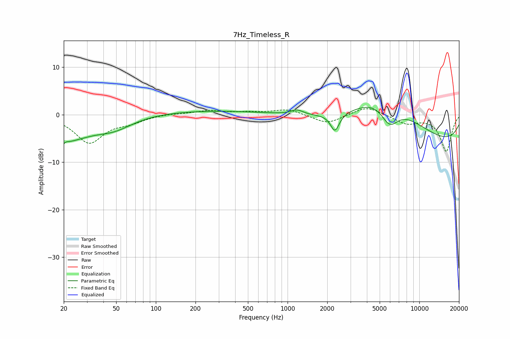

# 7Hz_Timeless_R
See [usage instructions](https://github.com/jaakkopasanen/AutoEq#usage) for more options and info.

### Parametric EQs
Apply preamp of -1.6 dB when using parametric equalizer.

|   # | Type    |   Fc (Hz) |    Q |   Gain (dB) |
|-----|---------|-----------|------|-------------|
|   1 | Peaking |        20 | 4.87 |        -4.4 |
|   2 | Peaking |        20 | 5.92 |         3.2 |
|   3 | Peaking |        22 | 0.79 |        -4.5 |
|   4 | Peaking |        48 | 1    |        -2.3 |
|   5 | Peaking |       245 | 0.3  |         0.9 |
|   6 | Peaking |      1182 | 3.07 |         1   |
|   7 | Peaking |      2288 | 4.27 |        -3.8 |
|   8 | Peaking |      5387 | 0.55 |        10   |
|   9 | Peaking |      5935 | 1.89 |        -5.3 |
|  10 | Peaking |      9719 | 0.18 |        -6.8 |

### Fixed Band EQs
When using fixed band (also called graphic) equalizer, apply preamp of **-1.3 dB** (if available) and set gains manually with these parameters.

|   # | Type    |   Fc (Hz) |    Q |   Gain (dB) |
|-----|---------|-----------|------|-------------|
|   1 | Peaking |        31 | 1.41 |        -5.8 |
|   2 | Peaking |        62 | 1.41 |        -1.3 |
|   3 | Peaking |       125 | 1.41 |         0.2 |
|   4 | Peaking |       250 | 1.41 |         0.8 |
|   5 | Peaking |       500 | 1.41 |         0.4 |
|   6 | Peaking |      1000 | 1.41 |         1.2 |
|   7 | Peaking |      2000 | 1.41 |        -2   |
|   8 | Peaking |      4000 | 1.41 |         1.9 |
|   9 | Peaking |      8000 | 1.41 |        -1.8 |
|  10 | Peaking |     16000 | 1.41 |        -7.7 |

### Graphs

