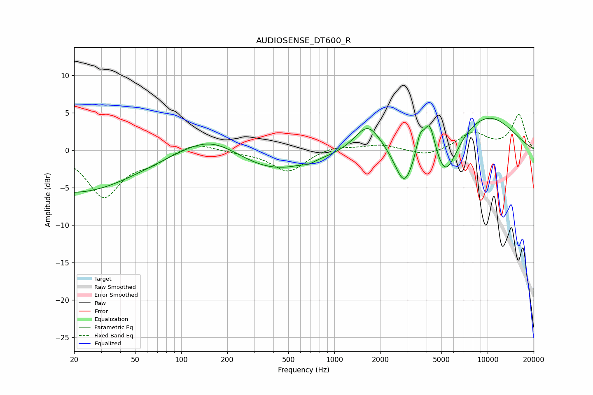

# AUDIOSENSE_DT600_R
See [usage instructions](https://github.com/jaakkopasanen/AutoEq#usage) for more options and info.

### Parametric EQs
Apply preamp of -4.4 dB when using parametric equalizer.

|   # | Type    |   Fc (Hz) |    Q |   Gain (dB) |
|-----|---------|-----------|------|-------------|
|   1 | Peaking |        20 | 0.35 |        -5.7 |
|   2 | Peaking |       156 | 0.73 |         2.8 |
|   3 | Peaking |       389 | 0.55 |        -3   |
|   4 | Peaking |       683 | 4.89 |        -0.3 |
|   5 | Peaking |      1654 | 1.66 |         3.8 |
|   6 | Peaking |      2858 | 2.33 |        -5.2 |
|   7 | Peaking |      3624 | 5.77 |         2.5 |
|   8 | Peaking |      4183 | 3.85 |         4.7 |
|   9 | Peaking |      5315 | 1.8  |        -5.5 |
|  10 | Peaking |      9658 | 0.58 |         4.8 |

### Fixed Band EQs
When using fixed band (also called graphic) equalizer, apply preamp of **-4.9 dB** (if available) and set gains manually with these parameters.

|   # | Type    |   Fc (Hz) |    Q |   Gain (dB) |
|-----|---------|-----------|------|-------------|
|   1 | Peaking |        31 | 1.41 |        -6.1 |
|   2 | Peaking |        62 | 1.41 |        -1.3 |
|   3 | Peaking |       125 | 1.41 |         1.1 |
|   4 | Peaking |       250 | 1.41 |        -0.2 |
|   5 | Peaking |       500 | 1.41 |        -2.9 |
|   6 | Peaking |      1000 | 1.41 |         0.6 |
|   7 | Peaking |      2000 | 1.41 |         0.8 |
|   8 | Peaking |      4000 | 1.41 |        -0.8 |
|   9 | Peaking |      8000 | 1.41 |         2.3 |
|  10 | Peaking |     16000 | 1.41 |         4.7 |

### Graphs

