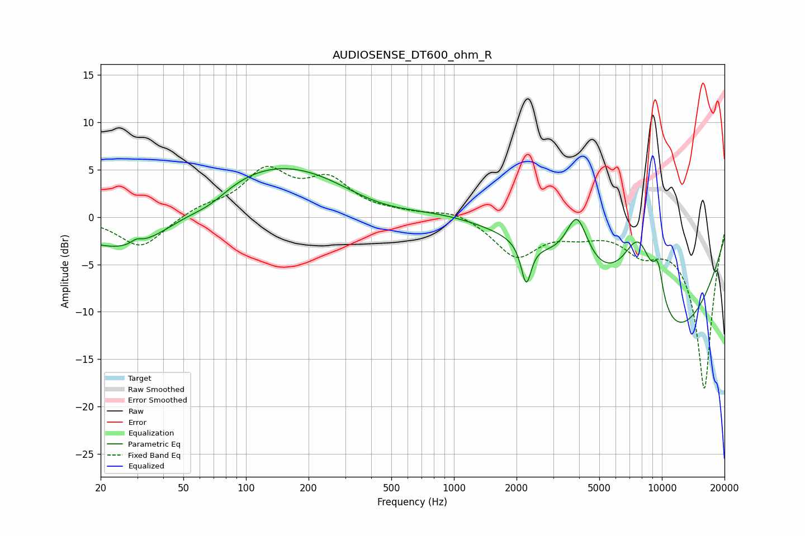

# AUDIOSENSE_DT600_ohm_R
See [usage instructions](https://github.com/jaakkopasanen/AutoEq#usage) for more options and info.

### Parametric EQs
Apply preamp of -5.2 dB when using parametric equalizer.

|   # | Type    |   Fc (Hz) |    Q |   Gain (dB) |
|-----|---------|-----------|------|-------------|
|   1 | Peaking |        29 | 0.56 |        -4.8 |
|   2 | Peaking |        30 | 5.54 |         0.5 |
|   3 | Peaking |        67 | 1.38 |        -1.3 |
|   4 | Peaking |       190 | 0.25 |         7.4 |
|   5 | Peaking |       425 | 0.56 |        -4.1 |
|   6 | Peaking |      2225 | 5.98 |        -4.4 |
|   7 | Peaking |      3907 | 2.64 |         5.5 |
|   8 | Peaking |      7773 | 1.41 |        10.2 |
|   9 | Peaking |      9587 | 5.45 |         3.5 |
|  10 | Peaking |     10000 | 0.36 |       -14.7 |

### Fixed Band EQs
When using fixed band (also called graphic) equalizer, apply preamp of **-5.5 dB** (if available) and set gains manually with these parameters.

|   # | Type    |   Fc (Hz) |    Q |   Gain (dB) |
|-----|---------|-----------|------|-------------|
|   1 | Peaking |        31 | 1.41 |        -3.3 |
|   2 | Peaking |        62 | 1.41 |         0.9 |
|   3 | Peaking |       125 | 1.41 |         4.6 |
|   4 | Peaking |       250 | 1.41 |         3.5 |
|   5 | Peaking |       500 | 1.41 |         0.3 |
|   6 | Peaking |      1000 | 1.41 |         0.8 |
|   7 | Peaking |      2000 | 1.41 |        -4.1 |
|   8 | Peaking |      4000 | 1.41 |        -1.2 |
|   9 | Peaking |      8000 | 1.41 |        -2.7 |
|  10 | Peaking |     16000 | 1.41 |       -18.1 |

### Graphs

