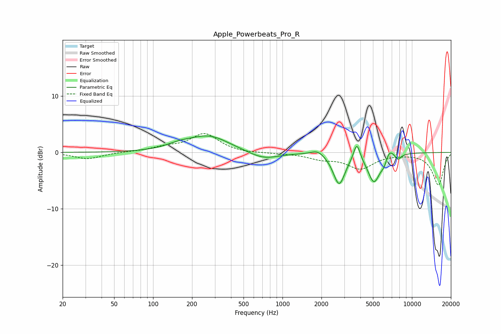

# Apple_Powerbeats_Pro_R
See [usage instructions](https://github.com/jaakkopasanen/AutoEq#usage) for more options and info.

### Parametric EQs
Apply preamp of -3.0 dB when using parametric equalizer.

|   # | Type    |   Fc (Hz) |    Q |   Gain (dB) |
|-----|---------|-----------|------|-------------|
|   1 | Peaking |       159 | 1.44 |         0.8 |
|   2 | Peaking |       271 | 0.9  |         2.8 |
|   3 | Peaking |       713 | 1.21 |        -1.4 |
|   4 | Peaking |      1872 | 2.78 |         1   |
|   5 | Peaking |      2738 | 3.11 |        -5.6 |
|   6 | Peaking |      3750 | 5.59 |         3.2 |
|   7 | Peaking |      5091 | 2.95 |        -5.1 |
|   8 | Peaking |      6090 | 5.87 |        -1.2 |
|   9 | Peaking |      6693 | 4.34 |         1.6 |
|  10 | Peaking |      7819 | 5.97 |        -1   |

### Fixed Band EQs
When using fixed band (also called graphic) equalizer, apply preamp of **-3.4 dB** (if available) and set gains manually with these parameters.

|   # | Type    |   Fc (Hz) |    Q |   Gain (dB) |
|-----|---------|-----------|------|-------------|
|   1 | Peaking |        31 | 1.41 |        -1.2 |
|   2 | Peaking |        62 | 1.41 |         0.1 |
|   3 | Peaking |       125 | 1.41 |         0.8 |
|   4 | Peaking |       250 | 1.41 |         3.3 |
|   5 | Peaking |       500 | 1.41 |        -0.2 |
|   6 | Peaking |      1000 | 1.41 |        -0.1 |
|   7 | Peaking |      2000 | 1.41 |        -1   |
|   8 | Peaking |      4000 | 1.41 |        -2.7 |
|   9 | Peaking |      8000 | 1.41 |        -0.1 |
|  10 | Peaking |     16000 | 1.41 |        -5.8 |

### Graphs

