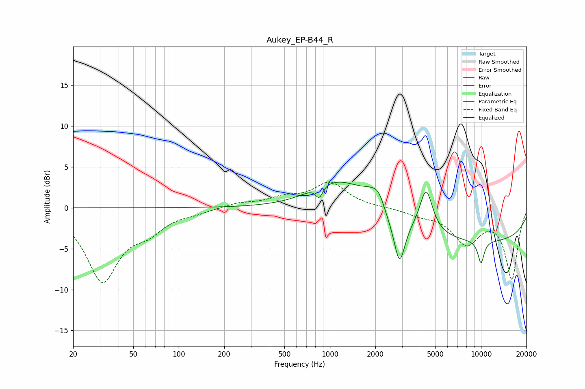

# Aukey_EP-B44_R
See [usage instructions](https://github.com/jaakkopasanen/AutoEq#usage) for more options and info.

### Parametric EQs
Apply preamp of -3.2 dB when using parametric equalizer.

|   # | Type    |   Fc (Hz) |    Q |   Gain (dB) |
|-----|---------|-----------|------|-------------|
|   1 | Peaking |       850 | 6    |        -1.5 |
|   2 | Peaking |       856 | 1.47 |         0.5 |
|   3 | Peaking |      1176 | 0.82 |         3.4 |
|   4 | Peaking |      2037 | 1.67 |         2.7 |
|   5 | Peaking |      2130 | 4.04 |         0.8 |
|   6 | Peaking |      2376 | 2.7  |        -1   |
|   7 | Peaking |      2888 | 3.83 |        -5.7 |
|   8 | Peaking |      4337 | 3.31 |         5.3 |
|   9 | Peaking |      9599 | 0.2  |        -4.1 |
|  10 | Peaking |     10000 | 5.93 |        -2.8 |

### Fixed Band EQs
When using fixed band (also called graphic) equalizer, apply preamp of **-3.2 dB** (if available) and set gains manually with these parameters.

|   # | Type    |   Fc (Hz) |    Q |   Gain (dB) |
|-----|---------|-----------|------|-------------|
|   1 | Peaking |        31 | 1.41 |        -8.7 |
|   2 | Peaking |        62 | 1.41 |        -2.2 |
|   3 | Peaking |       125 | 1.41 |        -0.5 |
|   4 | Peaking |       250 | 1.41 |         0.6 |
|   5 | Peaking |       500 | 1.41 |         1   |
|   6 | Peaking |      1000 | 1.41 |         3   |
|   7 | Peaking |      2000 | 1.41 |         0   |
|   8 | Peaking |      4000 | 1.41 |        -0.7 |
|   9 | Peaking |      8000 | 1.41 |        -4.1 |
|  10 | Peaking |     16000 | 1.41 |        -8.6 |

### Graphs

