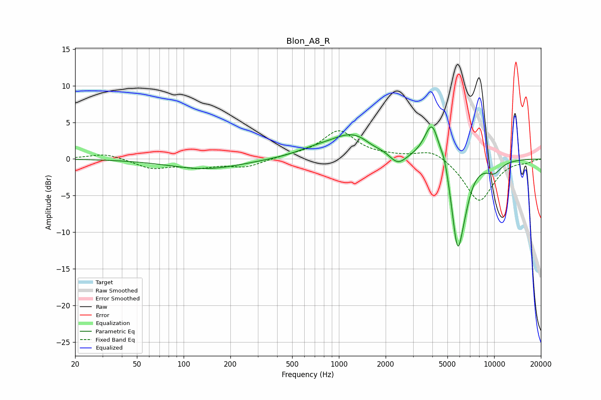

# Blon_A8_R
See [usage instructions](https://github.com/jaakkopasanen/AutoEq#usage) for more options and info.

### Parametric EQs
Apply preamp of -4.5 dB when using parametric equalizer.

|   # | Type    |   Fc (Hz) |    Q |   Gain (dB) |
|-----|---------|-----------|------|-------------|
|   1 | Peaking |       139 | 0.61 |        -1.4 |
|   2 | Peaking |       685 | 1.15 |         0.6 |
|   3 | Peaking |      1240 | 0.94 |         3.4 |
|   4 | Peaking |      1630 | 2.6  |        -0.5 |
|   5 | Peaking |      2393 | 2.56 |        -1.7 |
|   6 | Peaking |      3984 | 2.84 |         5.6 |
|   7 | Peaking |      4801 | 5.99 |         1.4 |
|   8 | Peaking |      5805 | 3.42 |       -11.4 |
|   9 | Peaking |      6407 | 3.12 |        -2.2 |
|  10 | Peaking |     10000 | 2.47 |        -1.5 |

### Fixed Band EQs
When using fixed band (also called graphic) equalizer, apply preamp of **-3.9 dB** (if available) and set gains manually with these parameters.

|   # | Type    |   Fc (Hz) |    Q |   Gain (dB) |
|-----|---------|-----------|------|-------------|
|   1 | Peaking |        31 | 1.41 |         0.8 |
|   2 | Peaking |        62 | 1.41 |        -1.2 |
|   3 | Peaking |       125 | 1.41 |        -1   |
|   4 | Peaking |       250 | 1.41 |        -1.1 |
|   5 | Peaking |       500 | 1.41 |         0.4 |
|   6 | Peaking |      1000 | 1.41 |         3.8 |
|   7 | Peaking |      2000 | 1.41 |         0.2 |
|   8 | Peaking |      4000 | 1.41 |         1.4 |
|   9 | Peaking |      8000 | 1.41 |        -5.9 |
|  10 | Peaking |     16000 | 1.41 |        -0.4 |

### Graphs

