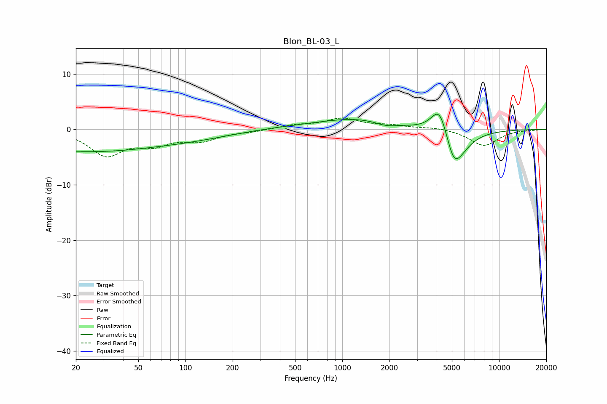

# Blon_BL-03_L
See [usage instructions](https://github.com/jaakkopasanen/AutoEq#usage) for more options and info.

### Parametric EQs
Apply preamp of -2.8 dB when using parametric equalizer.

|   # | Type    |   Fc (Hz) |    Q |   Gain (dB) |
|-----|---------|-----------|------|-------------|
|   1 | Peaking |        20 | 5.73 |         3.3 |
|   2 | Peaking |        20 | 5.85 |        -3.3 |
|   3 | Peaking |        22 | 0.28 |        -3.9 |
|   4 | Peaking |       124 | 0.55 |        -1   |
|   5 | Peaking |       493 | 0.45 |         0.4 |
|   6 | Peaking |      1285 | 0.59 |         1.8 |
|   7 | Peaking |      1901 | 1.94 |        -0.8 |
|   8 | Peaking |      4194 | 2.48 |         6.5 |
|   9 | Peaking |      5131 | 5.06 |        -0.6 |
|  10 | Peaking |      5181 | 1.82 |        -7.6 |

### Fixed Band EQs
When using fixed band (also called graphic) equalizer, apply preamp of **-2.2 dB** (if available) and set gains manually with these parameters.

|   # | Type    |   Fc (Hz) |    Q |   Gain (dB) |
|-----|---------|-----------|------|-------------|
|   1 | Peaking |        31 | 1.41 |        -4.5 |
|   2 | Peaking |        62 | 1.41 |        -2.3 |
|   3 | Peaking |       125 | 1.41 |        -1.8 |
|   4 | Peaking |       250 | 1.41 |        -0.3 |
|   5 | Peaking |       500 | 1.41 |         0.7 |
|   6 | Peaking |      1000 | 1.41 |         1.9 |
|   7 | Peaking |      2000 | 1.41 |         0.6 |
|   8 | Peaking |      4000 | 1.41 |         0.4 |
|   9 | Peaking |      8000 | 1.41 |        -2.9 |
|  10 | Peaking |     16000 | 1.41 |        -0.1 |

### Graphs

