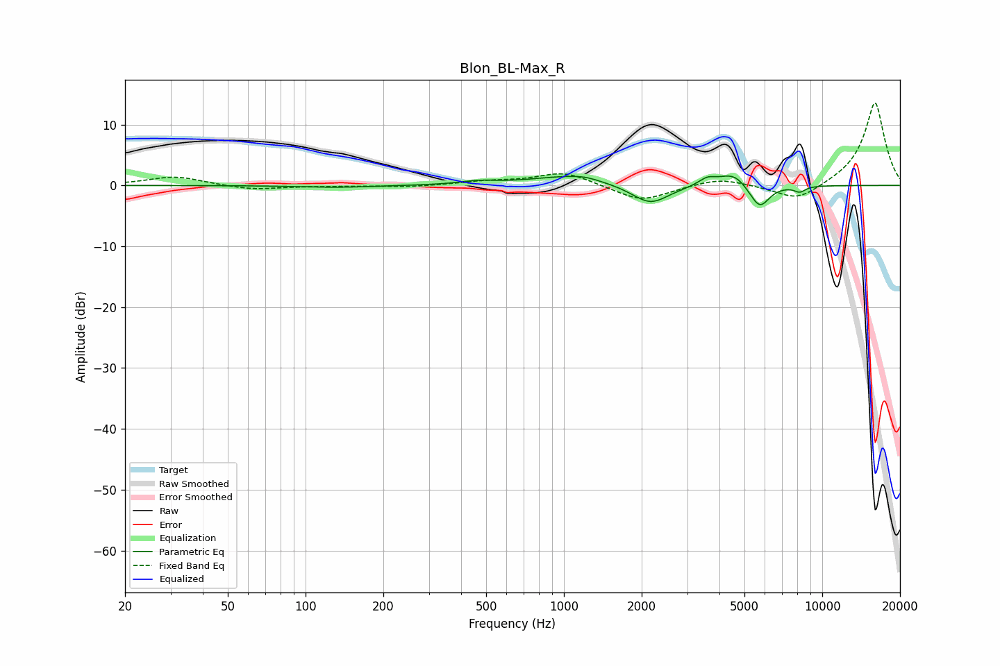

# Blon_BL-Max_R
See [usage instructions](https://github.com/jaakkopasanen/AutoEq#usage) for more options and info.

### Parametric EQs
Apply preamp of -1.6 dB when using parametric equalizer.

|   # | Type    |   Fc (Hz) |    Q |   Gain (dB) |
|-----|---------|-----------|------|-------------|
|   1 | Peaking |       133 | 0.99 |        -0.3 |
|   2 | Peaking |       468 | 1.96 |         0.5 |
|   3 | Peaking |      1042 | 0.98 |         1.5 |
|   4 | Peaking |      1210 | 2.79 |         0.4 |
|   5 | Peaking |      2162 | 1.97 |        -3.2 |
|   6 | Peaking |      3584 | 4.29 |         1.1 |
|   7 | Peaking |      4581 | 2.31 |         2.6 |
|   8 | Peaking |      5392 | 2.83 |        -1.2 |
|   9 | Peaking |      5758 | 3.85 |        -3.2 |
|  10 | Peaking |      8182 | 6    |        -0.9 |

### Fixed Band EQs
When using fixed band (also called graphic) equalizer, apply preamp of **-13.6 dB** (if available) and set gains manually with these parameters.

|   # | Type    |   Fc (Hz) |    Q |   Gain (dB) |
|-----|---------|-----------|------|-------------|
|   1 | Peaking |        31 | 1.41 |         1.5 |
|   2 | Peaking |        62 | 1.41 |        -0.7 |
|   3 | Peaking |       125 | 1.41 |        -0.1 |
|   4 | Peaking |       250 | 1.41 |        -0.3 |
|   5 | Peaking |       500 | 1.41 |         0.6 |
|   6 | Peaking |      1000 | 1.41 |         2.2 |
|   7 | Peaking |      2000 | 1.41 |        -2.7 |
|   8 | Peaking |      4000 | 1.41 |         1.3 |
|   9 | Peaking |      8000 | 1.41 |        -2.8 |
|  10 | Peaking |     16000 | 1.41 |        13.8 |

### Graphs

