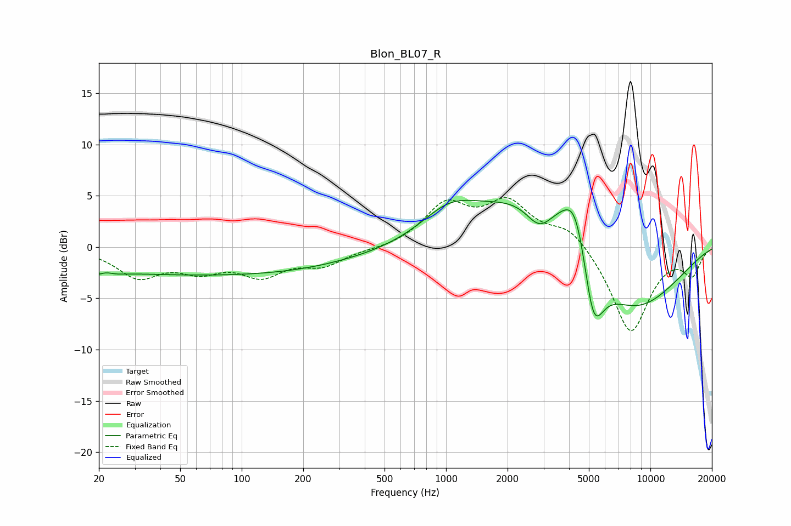

# Blon_BL07_R
See [usage instructions](https://github.com/jaakkopasanen/AutoEq#usage) for more options and info.

### Parametric EQs
Apply preamp of -4.6 dB when using parametric equalizer.

|   # | Type    |   Fc (Hz) |    Q |   Gain (dB) |
|-----|---------|-----------|------|-------------|
|   1 | Peaking |        21 | 2.67 |        -2.3 |
|   2 | Peaking |        21 | 3.34 |         1.9 |
|   3 | Peaking |        61 | 0.2  |        -2.7 |
|   4 | Peaking |       883 | 0.18 |        -0.5 |
|   5 | Peaking |      1037 | 1    |         2.8 |
|   6 | Peaking |      2858 | 2.06 |        -2.8 |
|   7 | Peaking |      3080 | 0.5  |         7.2 |
|   8 | Peaking |      4335 | 2.14 |         5.5 |
|   9 | Peaking |      5243 | 2.53 |        -7.9 |
|  10 | Peaking |      7747 | 0.53 |        -7.8 |

### Fixed Band EQs
When using fixed band (also called graphic) equalizer, apply preamp of **-4.9 dB** (if available) and set gains manually with these parameters.

|   # | Type    |   Fc (Hz) |    Q |   Gain (dB) |
|-----|---------|-----------|------|-------------|
|   1 | Peaking |        31 | 1.41 |        -2.7 |
|   2 | Peaking |        62 | 1.41 |        -1.9 |
|   3 | Peaking |       125 | 1.41 |        -2.5 |
|   4 | Peaking |       250 | 1.41 |        -1.6 |
|   5 | Peaking |       500 | 1.41 |        -0.2 |
|   6 | Peaking |      1000 | 1.41 |         3.9 |
|   7 | Peaking |      2000 | 1.41 |         4   |
|   8 | Peaking |      4000 | 1.41 |         2   |
|   9 | Peaking |      8000 | 1.41 |        -8.4 |
|  10 | Peaking |     16000 | 1.41 |        -2.5 |

### Graphs

