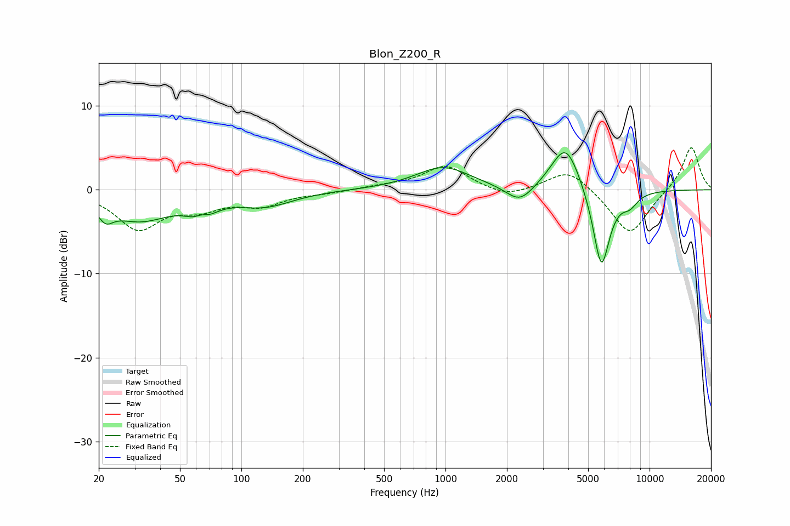

# Blon_Z200_R
See [usage instructions](https://github.com/jaakkopasanen/AutoEq#usage) for more options and info.

### Parametric EQs
Apply preamp of -4.5 dB when using parametric equalizer.

|   # | Type    |   Fc (Hz) |    Q |   Gain (dB) |
|-----|---------|-----------|------|-------------|
|   1 | Peaking |        22 | 3.9  |        -1.7 |
|   2 | Peaking |        32 | 0.91 |        -3.4 |
|   3 | Peaking |        64 | 2.54 |        -3.1 |
|   4 | Peaking |        64 | 3.89 |         1.8 |
|   5 | Peaking |       130 | 1.02 |        -1.8 |
|   6 | Peaking |       974 | 1.06 |         2.7 |
|   7 | Peaking |      2312 | 2.09 |        -2.2 |
|   8 | Peaking |      3885 | 1.95 |         5.8 |
|   9 | Peaking |      5804 | 3.25 |        -9.9 |
|  10 | Peaking |      8004 | 3.36 |        -1.3 |

### Fixed Band EQs
When using fixed band (also called graphic) equalizer, apply preamp of **-5.1 dB** (if available) and set gains manually with these parameters.

|   # | Type    |   Fc (Hz) |    Q |   Gain (dB) |
|-----|---------|-----------|------|-------------|
|   1 | Peaking |        31 | 1.41 |        -4.5 |
|   2 | Peaking |        62 | 1.41 |        -1.8 |
|   3 | Peaking |       125 | 1.41 |        -1.7 |
|   4 | Peaking |       250 | 1.41 |        -0.3 |
|   5 | Peaking |       500 | 1.41 |         0.4 |
|   6 | Peaking |      1000 | 1.41 |         2.9 |
|   7 | Peaking |      2000 | 1.41 |        -1   |
|   8 | Peaking |      4000 | 1.41 |         2.6 |
|   9 | Peaking |      8000 | 1.41 |        -5.5 |
|  10 | Peaking |     16000 | 1.41 |         5.3 |

### Graphs

