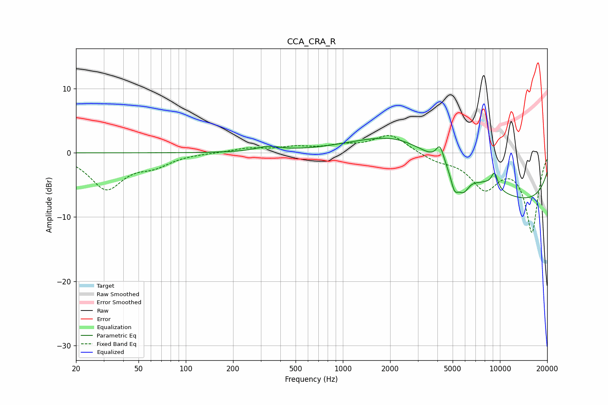

# CCA_CRA_R
See [usage instructions](https://github.com/jaakkopasanen/AutoEq#usage) for more options and info.

### Parametric EQs
Apply preamp of -2.4 dB when using parametric equalizer.

|   # | Type    |   Fc (Hz) |    Q |   Gain (dB) |
|-----|---------|-----------|------|-------------|
|   1 | Peaking |       335 | 1.87 |         0.8 |
|   2 | Peaking |      2389 | 0.58 |         3.9 |
|   3 | Peaking |      4154 | 5.65 |         2.7 |
|   4 | Peaking |      4205 | 0.26 |         3.2 |
|   5 | Peaking |      5141 | 5.73 |        -2.8 |
|   6 | Peaking |      5849 | 3.45 |        -3.3 |
|   7 | Peaking |      5927 | 1.76 |         1.3 |
|   8 | Peaking |      8113 | 4.44 |         0.4 |
|   9 | Peaking |      9233 | 5.69 |         2.6 |
|  10 | Peaking |     10000 | 0.18 |        -8.9 |

### Fixed Band EQs
When using fixed band (also called graphic) equalizer, apply preamp of **-2.8 dB** (if available) and set gains manually with these parameters.

|   # | Type    |   Fc (Hz) |    Q |   Gain (dB) |
|-----|---------|-----------|------|-------------|
|   1 | Peaking |        31 | 1.41 |        -5.5 |
|   2 | Peaking |        62 | 1.41 |        -1.7 |
|   3 | Peaking |       125 | 1.41 |         0   |
|   4 | Peaking |       250 | 1.41 |         0.7 |
|   5 | Peaking |       500 | 1.41 |         0.8 |
|   6 | Peaking |      1000 | 1.41 |         0.9 |
|   7 | Peaking |      2000 | 1.41 |         2.8 |
|   8 | Peaking |      4000 | 1.41 |        -1.1 |
|   9 | Peaking |      8000 | 1.41 |        -5.1 |
|  10 | Peaking |     16000 | 1.41 |       -12.2 |

### Graphs

