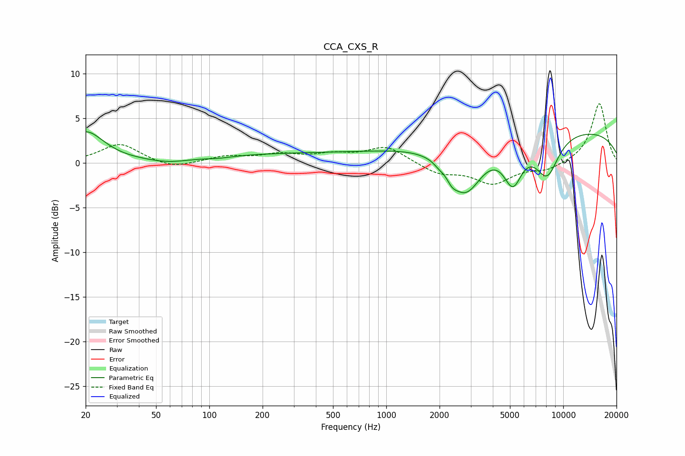

# CCA_CXS_R
See [usage instructions](https://github.com/jaakkopasanen/AutoEq#usage) for more options and info.

### Parametric EQs
Apply preamp of -3.6 dB when using parametric equalizer.

|   # | Type    |   Fc (Hz) |    Q |   Gain (dB) |
|-----|---------|-----------|------|-------------|
|   1 | Peaking |        20 | 1.38 |         3.5 |
|   2 | Peaking |        59 | 1.26 |        -0.4 |
|   3 | Peaking |       114 | 2.1  |        -0.2 |
|   4 | Peaking |       472 | 0.18 |         1.1 |
|   5 | Peaking |      1976 | 5.99 |        -0.3 |
|   6 | Peaking |      2351 | 4.96 |        -0.8 |
|   7 | Peaking |      2798 | 1.46 |        -5.9 |
|   8 | Peaking |      5193 | 2.63 |        -4.4 |
|   9 | Peaking |      8099 | 1.98 |        -4.5 |
|  10 | Peaking |      9186 | 0.18 |         3.9 |

### Fixed Band EQs
When using fixed band (also called graphic) equalizer, apply preamp of **-6.7 dB** (if available) and set gains manually with these parameters.

|   # | Type    |   Fc (Hz) |    Q |   Gain (dB) |
|-----|---------|-----------|------|-------------|
|   1 | Peaking |        31 | 1.41 |         2.1 |
|   2 | Peaking |        62 | 1.41 |        -0.7 |
|   3 | Peaking |       125 | 1.41 |         0.7 |
|   4 | Peaking |       250 | 1.41 |         0.8 |
|   5 | Peaking |       500 | 1.41 |         0.8 |
|   6 | Peaking |      1000 | 1.41 |         1.8 |
|   7 | Peaking |      2000 | 1.41 |        -1.2 |
|   8 | Peaking |      4000 | 1.41 |        -2.2 |
|   9 | Peaking |      8000 | 1.41 |        -0.8 |
|  10 | Peaking |     16000 | 1.41 |         6.7 |

### Graphs

