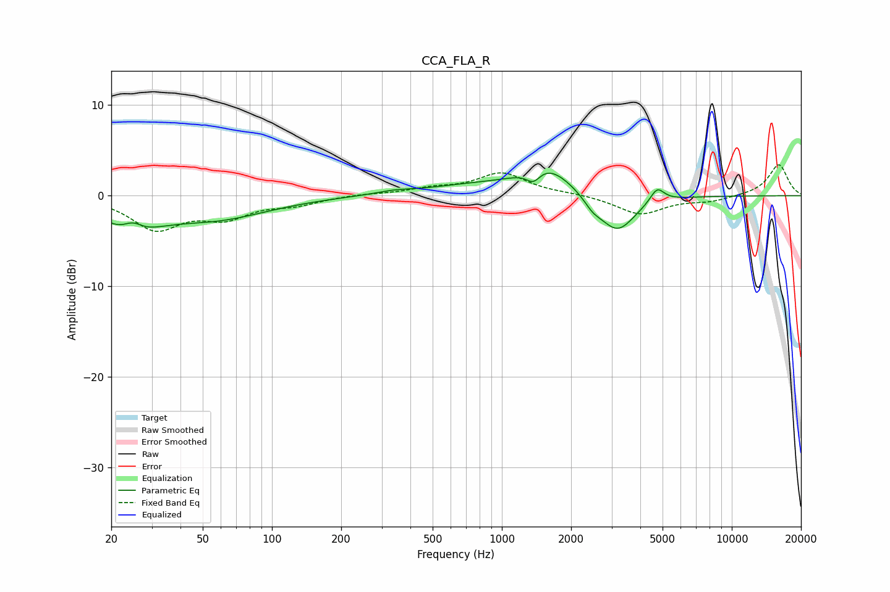

# CCA_FLA_R
See [usage instructions](https://github.com/jaakkopasanen/AutoEq#usage) for more options and info.

### Parametric EQs
Apply preamp of -2.6 dB when using parametric equalizer.

|   # | Type    |   Fc (Hz) |    Q |   Gain (dB) |
|-----|---------|-----------|------|-------------|
|   1 | Peaking |        24 | 1.13 |        -3.1 |
|   2 | Peaking |        25 | 3.49 |         1.1 |
|   3 | Peaking |        57 | 0.61 |        -2.3 |
|   4 | Peaking |       338 | 1.92 |         0.3 |
|   5 | Peaking |       801 | 0.59 |         1.1 |
|   6 | Peaking |      1370 | 4.58 |        -1.3 |
|   7 | Peaking |      1574 | 1.32 |         2.9 |
|   8 | Peaking |      2482 | 3.73 |        -0.9 |
|   9 | Peaking |      3169 | 1.78 |        -4.2 |
|  10 | Peaking |      4736 | 4.64 |         1.6 |

### Fixed Band EQs
When using fixed band (also called graphic) equalizer, apply preamp of **-3.5 dB** (if available) and set gains manually with these parameters.

|   # | Type    |   Fc (Hz) |    Q |   Gain (dB) |
|-----|---------|-----------|------|-------------|
|   1 | Peaking |        31 | 1.41 |        -3.5 |
|   2 | Peaking |        62 | 1.41 |        -2.1 |
|   3 | Peaking |       125 | 1.41 |        -0.8 |
|   4 | Peaking |       250 | 1.41 |         0.2 |
|   5 | Peaking |       500 | 1.41 |         0.7 |
|   6 | Peaking |      1000 | 1.41 |         2.4 |
|   7 | Peaking |      2000 | 1.41 |         0.2 |
|   8 | Peaking |      4000 | 1.41 |        -2.1 |
|   9 | Peaking |      8000 | 1.41 |        -0.6 |
|  10 | Peaking |     16000 | 1.41 |         3.5 |

### Graphs

