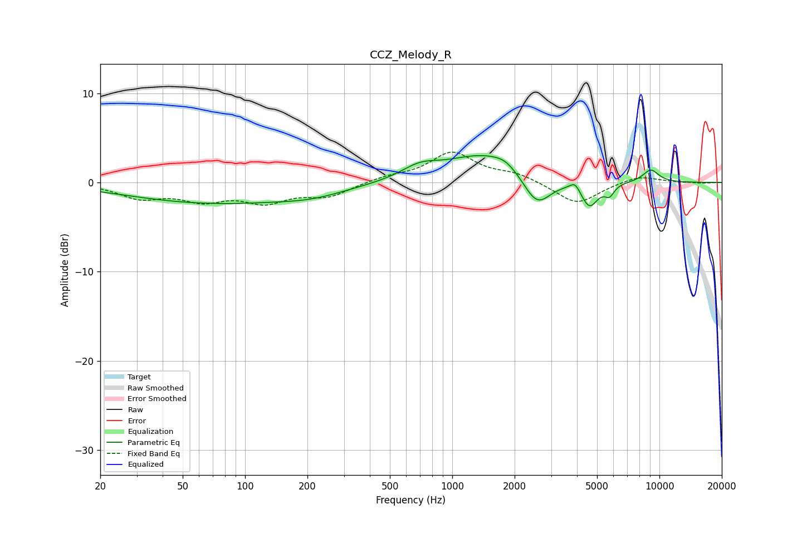

# CCZ_Melody_R
See [usage instructions](https://github.com/jaakkopasanen/AutoEq#usage) for more options and info.

### Parametric EQs
Apply preamp of -3.1 dB when using parametric equalizer.

|   # | Type    |   Fc (Hz) |    Q |   Gain (dB) |
|-----|---------|-----------|------|-------------|
|   1 | Peaking |        70 | 0.34 |        -2.2 |
|   2 | Peaking |       212 | 0.86 |        -0.8 |
|   3 | Peaking |       698 | 1.57 |         1.3 |
|   4 | Peaking |      1420 | 0.77 |         3.1 |
|   5 | Peaking |      1803 | 2.45 |         0.7 |
|   6 | Peaking |      2562 | 2.08 |        -3.6 |
|   7 | Peaking |      3916 | 5.98 |         0.9 |
|   8 | Peaking |      4596 | 3.43 |        -2.8 |
|   9 | Peaking |      5739 | 5.96 |        -1.2 |
|  10 | Peaking |      9091 | 3.19 |         1.4 |

### Fixed Band EQs
When using fixed band (also called graphic) equalizer, apply preamp of **-3.5 dB** (if available) and set gains manually with these parameters.

|   # | Type    |   Fc (Hz) |    Q |   Gain (dB) |
|-----|---------|-----------|------|-------------|
|   1 | Peaking |        31 | 1.41 |        -1.6 |
|   2 | Peaking |        62 | 1.41 |        -1.7 |
|   3 | Peaking |       125 | 1.41 |        -2   |
|   4 | Peaking |       250 | 1.41 |        -1.5 |
|   5 | Peaking |       500 | 1.41 |         0.6 |
|   6 | Peaking |      1000 | 1.41 |         3.3 |
|   7 | Peaking |      2000 | 1.41 |         0.9 |
|   8 | Peaking |      4000 | 1.41 |        -2.5 |
|   9 | Peaking |      8000 | 1.41 |         0.8 |
|  10 | Peaking |     16000 | 1.41 |        -0.1 |

### Graphs

