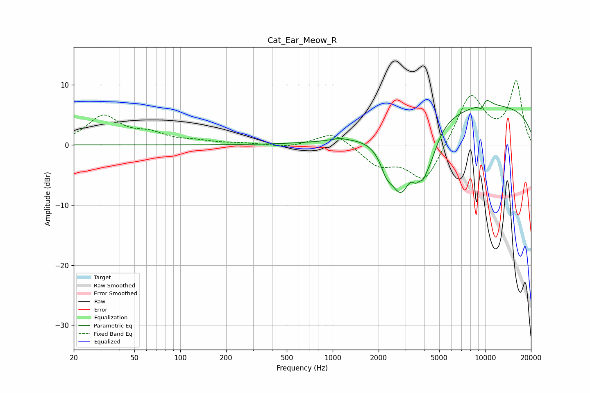

# Cat_Ear_Meow_R
See [usage instructions](https://github.com/jaakkopasanen/AutoEq#usage) for more options and info.

### Parametric EQs
Apply preamp of -7.5 dB when using parametric equalizer.

|   # | Type    |   Fc (Hz) |    Q |   Gain (dB) |
|-----|---------|-----------|------|-------------|
|   1 | Peaking |      1133 | 2.79 |         1.1 |
|   2 | Peaking |      1147 | 2.75 |        -0.7 |
|   3 | Peaking |      2254 | 3.52 |        -2.9 |
|   4 | Peaking |      2807 | 1.83 |       -10.4 |
|   5 | Peaking |      3525 | 5.75 |        -2.3 |
|   6 | Peaking |      3900 | 5.84 |        -2.2 |
|   7 | Peaking |      4298 | 2.44 |        -5.1 |
|   8 | Peaking |      9484 | 0.18 |         6.7 |
|   9 | Peaking |      9498 | 5.96 |        -1.5 |
|  10 | Peaking |     10000 | 3.18 |         1.7 |

### Fixed Band EQs
When using fixed band (also called graphic) equalizer, apply preamp of **-10.8 dB** (if available) and set gains manually with these parameters.

|   # | Type    |   Fc (Hz) |    Q |   Gain (dB) |
|-----|---------|-----------|------|-------------|
|   1 | Peaking |        31 | 1.41 |         4.7 |
|   2 | Peaking |        62 | 1.41 |         1.6 |
|   3 | Peaking |       125 | 1.41 |         0.5 |
|   4 | Peaking |       250 | 1.41 |         0.2 |
|   5 | Peaking |       500 | 1.41 |        -0.5 |
|   6 | Peaking |      1000 | 1.41 |         2.3 |
|   7 | Peaking |      2000 | 1.41 |        -3.2 |
|   8 | Peaking |      4000 | 1.41 |        -6.4 |
|   9 | Peaking |      8000 | 1.41 |         8.6 |
|  10 | Peaking |     16000 | 1.41 |        10.3 |

### Graphs

