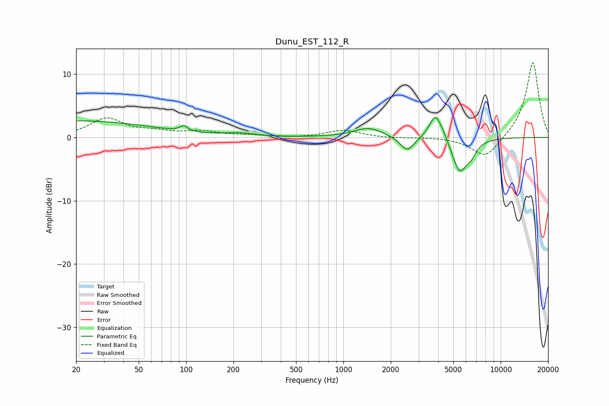

# Dunu_EST_112_R
See [usage instructions](https://github.com/jaakkopasanen/AutoEq#usage) for more options and info.

### Parametric EQs
Apply preamp of -3.2 dB when using parametric equalizer.

|   # | Type    |   Fc (Hz) |    Q |   Gain (dB) |
|-----|---------|-----------|------|-------------|
|   1 | Peaking |        20 | 0.29 |         2.6 |
|   2 | Peaking |        95 | 6    |        -0.8 |
|   3 | Peaking |        96 | 5.8  |         1.6 |
|   4 | Peaking |       217 | 1.48 |         0.5 |
|   5 | Peaking |      1443 | 1.54 |         1.5 |
|   6 | Peaking |      2546 | 3.1  |        -2.3 |
|   7 | Peaking |      3843 | 3.58 |         4   |
|   8 | Peaking |      4327 | 5.02 |         0.6 |
|   9 | Peaking |      5475 | 2.93 |        -5.3 |
|  10 | Peaking |      6486 | 3.9  |        -1.6 |

### Fixed Band EQs
When using fixed band (also called graphic) equalizer, apply preamp of **-11.9 dB** (if available) and set gains manually with these parameters.

|   # | Type    |   Fc (Hz) |    Q |   Gain (dB) |
|-----|---------|-----------|------|-------------|
|   1 | Peaking |        31 | 1.41 |         2.9 |
|   2 | Peaking |        62 | 1.41 |         0.7 |
|   3 | Peaking |       125 | 1.41 |         0.9 |
|   4 | Peaking |       250 | 1.41 |         0.3 |
|   5 | Peaking |       500 | 1.41 |        -0.1 |
|   6 | Peaking |      1000 | 1.41 |         1.1 |
|   7 | Peaking |      2000 | 1.41 |        -0.1 |
|   8 | Peaking |      4000 | 1.41 |         0.1 |
|   9 | Peaking |      8000 | 1.41 |        -3.4 |
|  10 | Peaking |     16000 | 1.41 |        12   |

### Graphs

