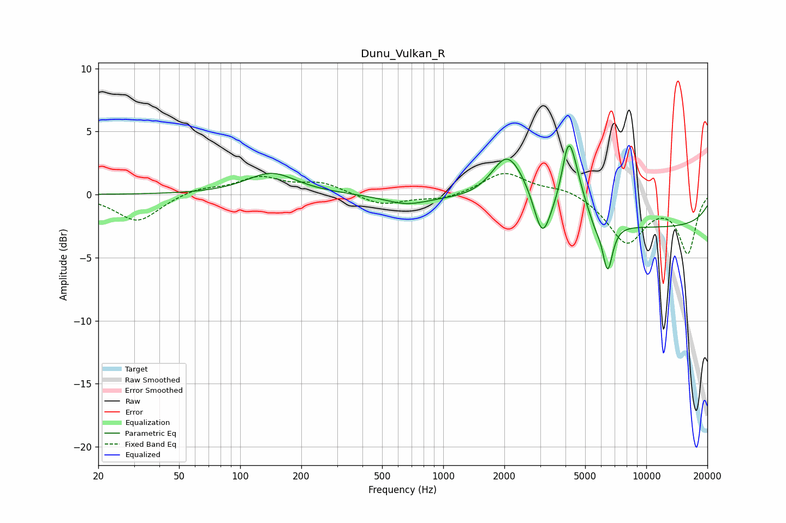

# Dunu_Vulkan_R
See [usage instructions](https://github.com/jaakkopasanen/AutoEq#usage) for more options and info.

### Parametric EQs
Apply preamp of -4.0 dB when using parametric equalizer.

|   # | Type    |   Fc (Hz) |    Q |   Gain (dB) |
|-----|---------|-----------|------|-------------|
|   1 | Peaking |       142 | 1.15 |         1.7 |
|   2 | Peaking |       658 | 1.31 |        -0.7 |
|   3 | Peaking |      2045 | 1.85 |         3.3 |
|   4 | Peaking |      2440 | 1.57 |         1.3 |
|   5 | Peaking |      3073 | 3.56 |        -3.4 |
|   6 | Peaking |      4124 | 4.41 |         4.4 |
|   7 | Peaking |      4472 | 3.23 |         2.2 |
|   8 | Peaking |      5603 | 5.64 |        -0.6 |
|   9 | Peaking |      6449 | 5.38 |        -3.9 |
|  10 | Peaking |     10000 | 0.18 |        -2.6 |

### Fixed Band EQs
When using fixed band (also called graphic) equalizer, apply preamp of **-1.8 dB** (if available) and set gains manually with these parameters.

|   # | Type    |   Fc (Hz) |    Q |   Gain (dB) |
|-----|---------|-----------|------|-------------|
|   1 | Peaking |        31 | 1.41 |        -2.2 |
|   2 | Peaking |        62 | 1.41 |         0.5 |
|   3 | Peaking |       125 | 1.41 |         1.3 |
|   4 | Peaking |       250 | 1.41 |         0.9 |
|   5 | Peaking |       500 | 1.41 |        -0.9 |
|   6 | Peaking |      1000 | 1.41 |        -0.4 |
|   7 | Peaking |      2000 | 1.41 |         1.8 |
|   8 | Peaking |      4000 | 1.41 |         0.6 |
|   9 | Peaking |      8000 | 1.41 |        -3.7 |
|  10 | Peaking |     16000 | 1.41 |        -4.5 |

### Graphs

