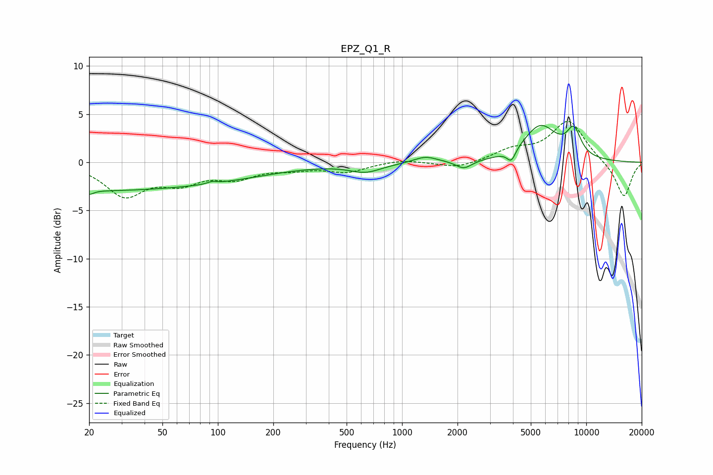

# EPZ_Q1_R
See [usage instructions](https://github.com/jaakkopasanen/AutoEq#usage) for more options and info.

### Parametric EQs
Apply preamp of -3.9 dB when using parametric equalizer.

|   # | Type    |   Fc (Hz) |    Q |   Gain (dB) |
|-----|---------|-----------|------|-------------|
|   1 | Peaking |        20 | 5.98 |        -0.5 |
|   2 | Peaking |        20 | 0.55 |        -0.3 |
|   3 | Peaking |        32 | 0.18 |        -2.6 |
|   4 | Peaking |        93 | 5.99 |         0.2 |
|   5 | Peaking |       634 | 1.61 |        -0.9 |
|   6 | Peaking |      1338 | 2.23 |         0.6 |
|   7 | Peaking |      2167 | 3.2  |        -0.9 |
|   8 | Peaking |      3920 | 6    |        -1.3 |
|   9 | Peaking |      5637 | 1.51 |         3.7 |
|  10 | Peaking |      8567 | 3.41 |         2.7 |

### Fixed Band EQs
When using fixed band (also called graphic) equalizer, apply preamp of **-4.3 dB** (if available) and set gains manually with these parameters.

|   # | Type    |   Fc (Hz) |    Q |   Gain (dB) |
|-----|---------|-----------|------|-------------|
|   1 | Peaking |        31 | 1.41 |        -3.3 |
|   2 | Peaking |        62 | 1.41 |        -1.8 |
|   3 | Peaking |       125 | 1.41 |        -1.4 |
|   4 | Peaking |       250 | 1.41 |        -0.6 |
|   5 | Peaking |       500 | 1.41 |        -0.9 |
|   6 | Peaking |      1000 | 1.41 |         0.3 |
|   7 | Peaking |      2000 | 1.41 |        -0.7 |
|   8 | Peaking |      4000 | 1.41 |         1.2 |
|   9 | Peaking |      8000 | 1.41 |         4.3 |
|  10 | Peaking |     16000 | 1.41 |        -3.7 |

### Graphs

