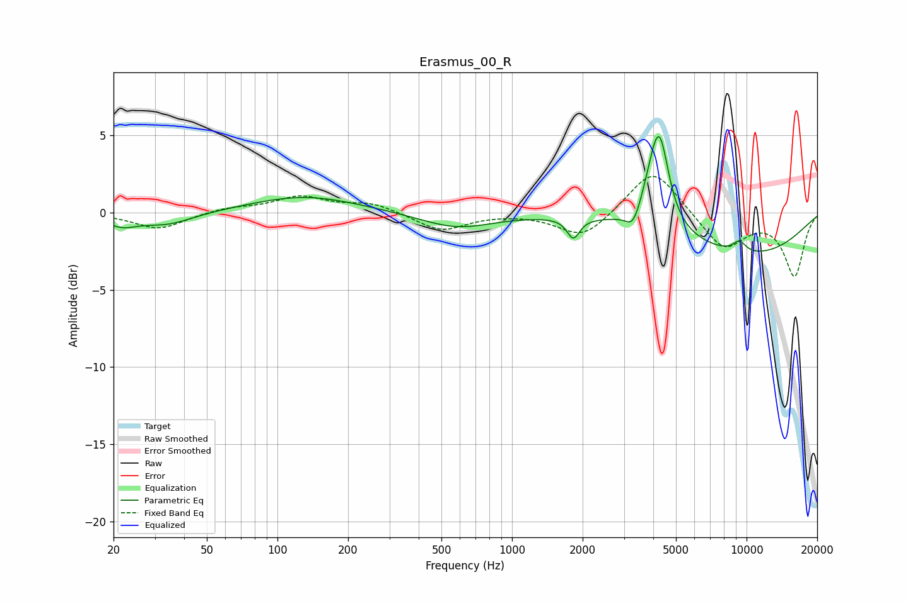

# Erasmus_00_R
See [usage instructions](https://github.com/jaakkopasanen/AutoEq#usage) for more options and info.

### Parametric EQs
Apply preamp of -5.0 dB when using parametric equalizer.

|   # | Type    |   Fc (Hz) |    Q |   Gain (dB) |
|-----|---------|-----------|------|-------------|
|   1 | Peaking |        22 | 2.19 |        -0.7 |
|   2 | Peaking |        34 | 1.22 |        -0.8 |
|   3 | Peaking |       131 | 0.62 |         1.1 |
|   4 | Peaking |       581 | 0.91 |        -1   |
|   5 | Peaking |      1825 | 5.36 |        -1.3 |
|   6 | Peaking |      3284 | 4.63 |        -1.2 |
|   7 | Peaking |      3973 | 3.09 |         1.7 |
|   8 | Peaking |      4260 | 3.6  |         5   |
|   9 | Peaking |      9315 | 4.4  |         0.7 |
|  10 | Peaking |     10000 | 0.41 |        -2.7 |

### Fixed Band EQs
When using fixed band (also called graphic) equalizer, apply preamp of **-2.4 dB** (if available) and set gains manually with these parameters.

|   # | Type    |   Fc (Hz) |    Q |   Gain (dB) |
|-----|---------|-----------|------|-------------|
|   1 | Peaking |        31 | 1.41 |        -1.1 |
|   2 | Peaking |        62 | 1.41 |         0.3 |
|   3 | Peaking |       125 | 1.41 |         1   |
|   4 | Peaking |       250 | 1.41 |         0.6 |
|   5 | Peaking |       500 | 1.41 |        -1.2 |
|   6 | Peaking |      1000 | 1.41 |         0   |
|   7 | Peaking |      2000 | 1.41 |        -1.7 |
|   8 | Peaking |      4000 | 1.41 |         3   |
|   9 | Peaking |      8000 | 1.41 |        -2.4 |
|  10 | Peaking |     16000 | 1.41 |        -4.1 |

### Graphs

