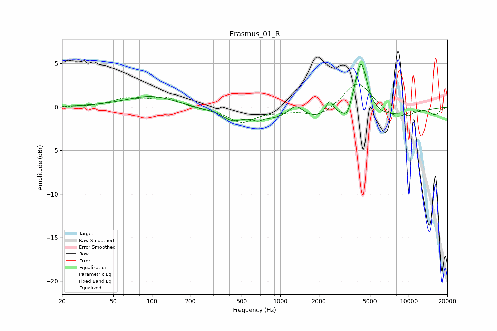

# Erasmus_01_R
See [usage instructions](https://github.com/jaakkopasanen/AutoEq#usage) for more options and info.

### Parametric EQs
Apply preamp of -5.0 dB when using parametric equalizer.

|   # | Type    |   Fc (Hz) |    Q |   Gain (dB) |
|-----|---------|-----------|------|-------------|
|   1 | Peaking |        99 | 0.73 |         1.3 |
|   2 | Peaking |       423 | 2.48 |        -0.7 |
|   3 | Peaking |       666 | 4.93 |        -0.4 |
|   4 | Peaking |      1322 | 2.38 |         1.6 |
|   5 | Peaking |      2031 | 0.18 |        -1.7 |
|   6 | Peaking |      2423 | 4.73 |         1.8 |
|   7 | Peaking |      3307 | 4.88 |        -1.1 |
|   8 | Peaking |      4253 | 2.95 |         6.5 |
|   9 | Peaking |     10000 | 5.31 |        -0.3 |
|  10 | Peaking |     10000 | 5.16 |        -0.1 |

### Fixed Band EQs
When using fixed band (also called graphic) equalizer, apply preamp of **-2.7 dB** (if available) and set gains manually with these parameters.

|   # | Type    |   Fc (Hz) |    Q |   Gain (dB) |
|-----|---------|-----------|------|-------------|
|   1 | Peaking |        31 | 1.41 |        -0   |
|   2 | Peaking |        62 | 1.41 |         0.9 |
|   3 | Peaking |       125 | 1.41 |         1.1 |
|   4 | Peaking |       250 | 1.41 |        -0.2 |
|   5 | Peaking |       500 | 1.41 |        -1.7 |
|   6 | Peaking |      1000 | 1.41 |        -0.4 |
|   7 | Peaking |      2000 | 1.41 |        -1.1 |
|   8 | Peaking |      4000 | 1.41 |         3   |
|   9 | Peaking |      8000 | 1.41 |        -1.4 |
|  10 | Peaking |     16000 | 1.41 |        -0.9 |

### Graphs

