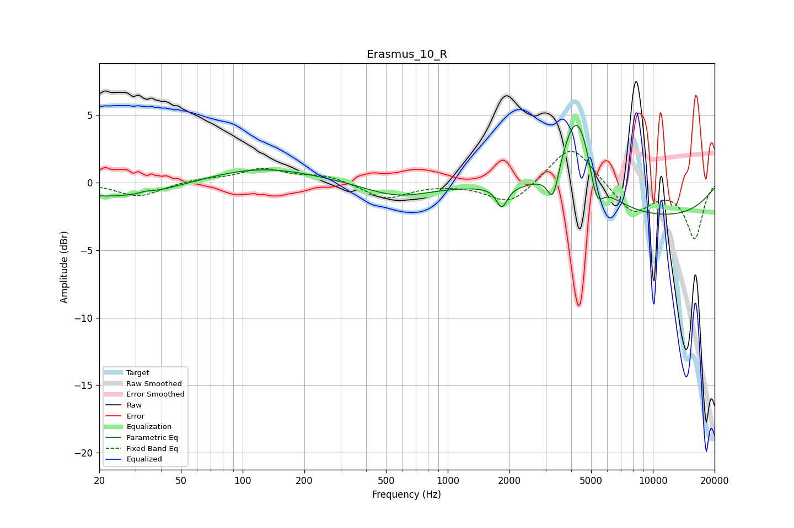

# Erasmus_10_R
See [usage instructions](https://github.com/jaakkopasanen/AutoEq#usage) for more options and info.

### Parametric EQs
Apply preamp of -4.3 dB when using parametric equalizer.

|   # | Type    |   Fc (Hz) |    Q |   Gain (dB) |
|-----|---------|-----------|------|-------------|
|   1 | Peaking |        25 | 0.49 |        -1.2 |
|   2 | Peaking |        34 | 5.71 |         0.1 |
|   3 | Peaking |       119 | 0.52 |         1.2 |
|   4 | Peaking |       568 | 0.88 |        -1   |
|   5 | Peaking |      1835 | 5.38 |        -1.5 |
|   6 | Peaking |      3262 | 5.01 |        -2.5 |
|   7 | Peaking |      4275 | 1.84 |         6.4 |
|   8 | Peaking |      4302 | 1.94 |         0.4 |
|   9 | Peaking |      5312 | 4.17 |        -2.6 |
|  10 | Peaking |     10000 | 0.3  |        -2.6 |

### Fixed Band EQs
When using fixed band (also called graphic) equalizer, apply preamp of **-2.4 dB** (if available) and set gains manually with these parameters.

|   # | Type    |   Fc (Hz) |    Q |   Gain (dB) |
|-----|---------|-----------|------|-------------|
|   1 | Peaking |        31 | 1.41 |        -1   |
|   2 | Peaking |        62 | 1.41 |         0.3 |
|   3 | Peaking |       125 | 1.41 |         1   |
|   4 | Peaking |       250 | 1.41 |         0.5 |
|   5 | Peaking |       500 | 1.41 |        -1.2 |
|   6 | Peaking |      1000 | 1.41 |        -0   |
|   7 | Peaking |      2000 | 1.41 |        -1.7 |
|   8 | Peaking |      4000 | 1.41 |         3   |
|   9 | Peaking |      8000 | 1.41 |        -2.3 |
|  10 | Peaking |     16000 | 1.41 |        -4.1 |

### Graphs

