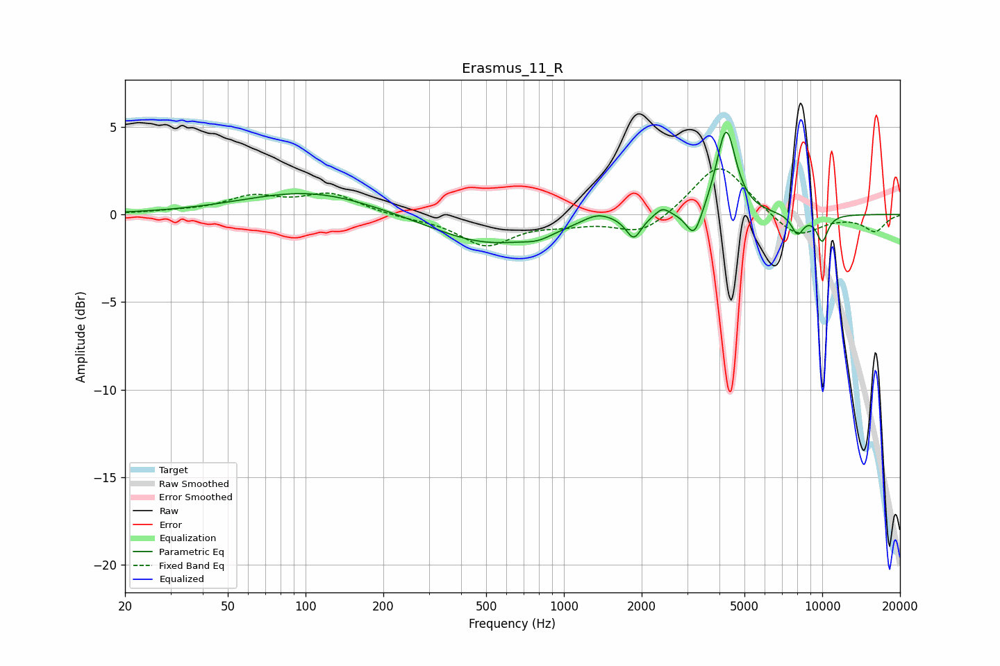

# Erasmus_11_R
See [usage instructions](https://github.com/jaakkopasanen/AutoEq#usage) for more options and info.

### Parametric EQs
Apply preamp of -4.8 dB when using parametric equalizer.

|   # | Type    |   Fc (Hz) |    Q |   Gain (dB) |
|-----|---------|-----------|------|-------------|
|   1 | Peaking |       104 | 0.55 |         1.3 |
|   2 | Peaking |       508 | 0.65 |        -1.7 |
|   3 | Peaking |       794 | 2.51 |        -0.4 |
|   4 | Peaking |      1348 | 2.44 |         0.5 |
|   5 | Peaking |      1864 | 4.92 |        -1.3 |
|   6 | Peaking |      2409 | 4.86 |         0.5 |
|   7 | Peaking |      3194 | 4.71 |        -1.7 |
|   8 | Peaking |      4245 | 3.77 |         5   |
|   9 | Peaking |      8022 | 5.54 |        -1.1 |
|  10 | Peaking |     10000 | 5.49 |        -1.5 |

### Fixed Band EQs
When using fixed band (also called graphic) equalizer, apply preamp of **-2.7 dB** (if available) and set gains manually with these parameters.

|   # | Type    |   Fc (Hz) |    Q |   Gain (dB) |
|-----|---------|-----------|------|-------------|
|   1 | Peaking |        31 | 1.41 |         0.1 |
|   2 | Peaking |        62 | 1.41 |         0.9 |
|   3 | Peaking |       125 | 1.41 |         1.1 |
|   4 | Peaking |       250 | 1.41 |        -0.2 |
|   5 | Peaking |       500 | 1.41 |        -1.7 |
|   6 | Peaking |      1000 | 1.41 |        -0.4 |
|   7 | Peaking |      2000 | 1.41 |        -1.2 |
|   8 | Peaking |      4000 | 1.41 |         3   |
|   9 | Peaking |      8000 | 1.41 |        -1.4 |
|  10 | Peaking |     16000 | 1.41 |        -0.9 |

### Graphs

