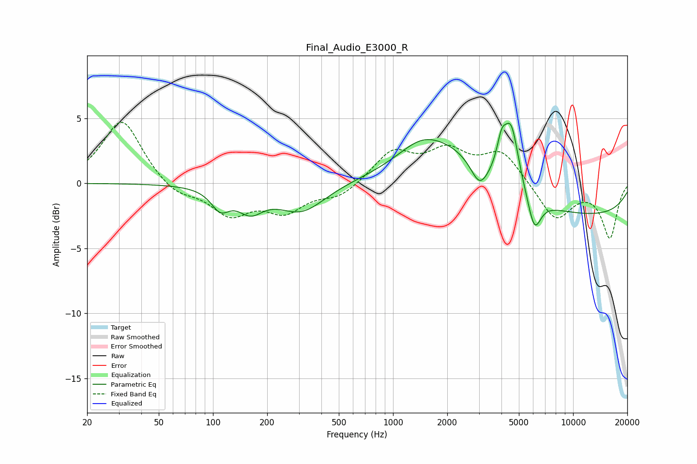

# Final_Audio_E3000_R
See [usage instructions](https://github.com/jaakkopasanen/AutoEq#usage) for more options and info.

### Parametric EQs
Apply preamp of -4.7 dB when using parametric equalizer.

|   # | Type    |   Fc (Hz) |    Q |   Gain (dB) |
|-----|---------|-----------|------|-------------|
|   1 | Peaking |       110 | 2.79 |        -1.5 |
|   2 | Peaking |       161 | 1.99 |        -1.7 |
|   3 | Peaking |       310 | 1.07 |        -2.2 |
|   4 | Peaking |      1429 | 1.13 |         1.3 |
|   5 | Peaking |      2173 | 0.56 |         3.8 |
|   6 | Peaking |      3025 | 2.88 |        -1.9 |
|   7 | Peaking |      4004 | 5.47 |         2   |
|   8 | Peaking |      4532 | 3.38 |         4.7 |
|   9 | Peaking |      6096 | 3.79 |        -2.6 |
|  10 | Peaking |      8768 | 0.18 |        -2.6 |

### Fixed Band EQs
When using fixed band (also called graphic) equalizer, apply preamp of **-4.8 dB** (if available) and set gains manually with these parameters.

|   # | Type    |   Fc (Hz) |    Q |   Gain (dB) |
|-----|---------|-----------|------|-------------|
|   1 | Peaking |        31 | 1.41 |         5   |
|   2 | Peaking |        62 | 1.41 |        -1   |
|   3 | Peaking |       125 | 1.41 |        -2.3 |
|   4 | Peaking |       250 | 1.41 |        -2   |
|   5 | Peaking |       500 | 1.41 |        -1   |
|   6 | Peaking |      1000 | 1.41 |         2.4 |
|   7 | Peaking |      2000 | 1.41 |         2.2 |
|   8 | Peaking |      4000 | 1.41 |         2.4 |
|   9 | Peaking |      8000 | 1.41 |        -2.8 |
|  10 | Peaking |     16000 | 1.41 |        -4.1 |

### Graphs

