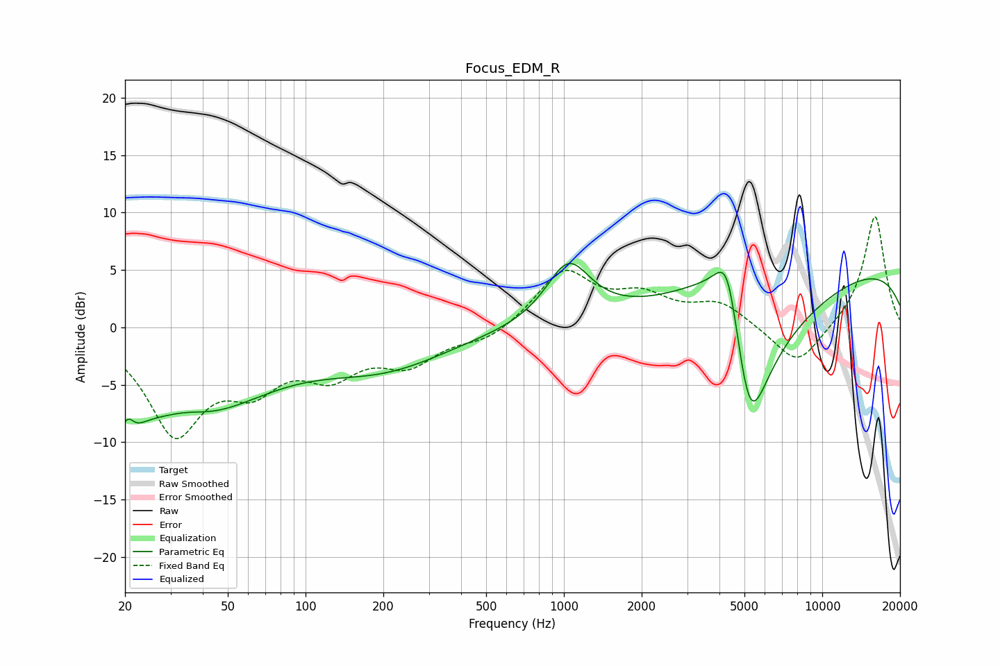

# Focus_EDM_R
See [usage instructions](https://github.com/jaakkopasanen/AutoEq#usage) for more options and info.

### Parametric EQs
Apply preamp of -5.7 dB when using parametric equalizer.

|   # | Type    |   Fc (Hz) |    Q |   Gain (dB) |
|-----|---------|-----------|------|-------------|
|   1 | Peaking |        20 | 3.04 |        -4.4 |
|   2 | Peaking |        21 | 6    |         2.4 |
|   3 | Peaking |        34 | 0.49 |        -8.3 |
|   4 | Peaking |        34 | 1.38 |         1.4 |
|   5 | Peaking |       204 | 0.57 |        -3.1 |
|   6 | Peaking |      1040 | 1.66 |         5.2 |
|   7 | Peaking |      4023 | 0.84 |         7.2 |
|   8 | Peaking |      4310 | 2.75 |         6.8 |
|   9 | Peaking |      5209 | 1.15 |       -20   |
|  10 | Peaking |     10000 | 0.18 |         5.7 |

### Fixed Band EQs
When using fixed band (also called graphic) equalizer, apply preamp of **-9.7 dB** (if available) and set gains manually with these parameters.

|   # | Type    |   Fc (Hz) |    Q |   Gain (dB) |
|-----|---------|-----------|------|-------------|
|   1 | Peaking |        31 | 1.41 |        -8.8 |
|   2 | Peaking |        62 | 1.41 |        -4.1 |
|   3 | Peaking |       125 | 1.41 |        -3.4 |
|   4 | Peaking |       250 | 1.41 |        -2.8 |
|   5 | Peaking |       500 | 1.41 |        -1.2 |
|   6 | Peaking |      1000 | 1.41 |         4.8 |
|   7 | Peaking |      2000 | 1.41 |         2.3 |
|   8 | Peaking |      4000 | 1.41 |         2   |
|   9 | Peaking |      8000 | 1.41 |        -3.5 |
|  10 | Peaking |     16000 | 1.41 |         9.8 |

### Graphs

