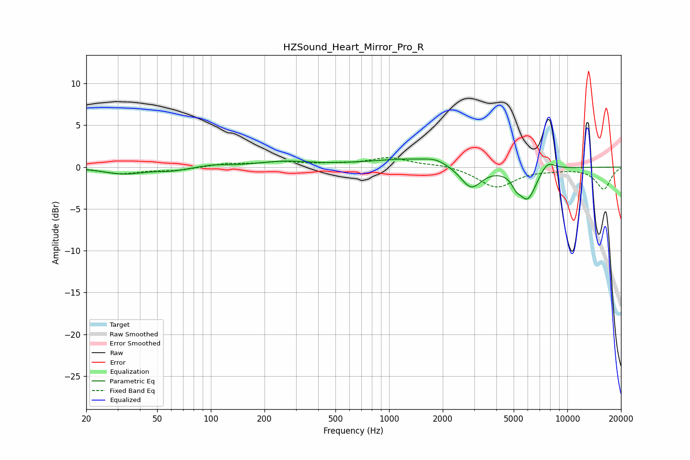

# HZSound_Heart_Mirror_Pro_R
See [usage instructions](https://github.com/jaakkopasanen/AutoEq#usage) for more options and info.

### Parametric EQs
Apply preamp of -1.1 dB when using parametric equalizer.

|   # | Type    |   Fc (Hz) |    Q |   Gain (dB) |
|-----|---------|-----------|------|-------------|
|   1 | Peaking |        33 | 1.21 |        -0.8 |
|   2 | Peaking |        61 | 1.81 |        -0.3 |
|   3 | Peaking |       104 | 2.11 |         0.2 |
|   4 | Peaking |       258 | 0.93 |         0.6 |
|   5 | Peaking |      1373 | 0.6  |         1   |
|   6 | Peaking |      1822 | 2.62 |         0.4 |
|   7 | Peaking |      2882 | 2.34 |        -2.8 |
|   8 | Peaking |      5162 | 6    |        -0.9 |
|   9 | Peaking |      5977 | 2.74 |        -3.9 |
|  10 | Peaking |      7732 | 3.12 |         1.3 |

### Fixed Band EQs
When using fixed band (also called graphic) equalizer, apply preamp of **-1.2 dB** (if available) and set gains manually with these parameters.

|   # | Type    |   Fc (Hz) |    Q |   Gain (dB) |
|-----|---------|-----------|------|-------------|
|   1 | Peaking |        31 | 1.41 |        -0.8 |
|   2 | Peaking |        62 | 1.41 |        -0.4 |
|   3 | Peaking |       125 | 1.41 |         0.4 |
|   4 | Peaking |       250 | 1.41 |         0.5 |
|   5 | Peaking |       500 | 1.41 |         0.3 |
|   6 | Peaking |      1000 | 1.41 |         1.1 |
|   7 | Peaking |      2000 | 1.41 |         0.3 |
|   8 | Peaking |      4000 | 1.41 |        -2.4 |
|   9 | Peaking |      8000 | 1.41 |        -0.2 |
|  10 | Peaking |     16000 | 1.41 |        -2.6 |

### Graphs

