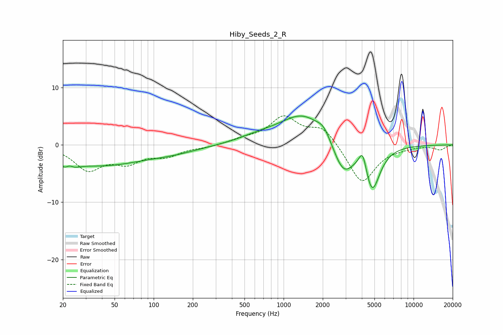

# Hiby_Seeds_2_R
See [usage instructions](https://github.com/jaakkopasanen/AutoEq#usage) for more options and info.

### Parametric EQs
Apply preamp of -5.1 dB when using parametric equalizer.

|   # | Type    |   Fc (Hz) |    Q |   Gain (dB) |
|-----|---------|-----------|------|-------------|
|   1 | Peaking |        22 | 2.86 |        -3   |
|   2 | Peaking |        22 | 4.43 |         2   |
|   3 | Peaking |        39 | 0.43 |        -3.4 |
|   4 | Peaking |       142 | 0.69 |        -0.9 |
|   5 | Peaking |       635 | 0.92 |         0.9 |
|   6 | Peaking |      1422 | 0.79 |         5.4 |
|   7 | Peaking |      2038 | 2.91 |         1.5 |
|   8 | Peaking |      2877 | 1.74 |        -5.7 |
|   9 | Peaking |      4061 | 4.74 |         3.7 |
|  10 | Peaking |      4794 | 2.33 |        -8   |

### Fixed Band EQs
When using fixed band (also called graphic) equalizer, apply preamp of **-5.2 dB** (if available) and set gains manually with these parameters.

|   # | Type    |   Fc (Hz) |    Q |   Gain (dB) |
|-----|---------|-----------|------|-------------|
|   1 | Peaking |        31 | 1.41 |        -4.1 |
|   2 | Peaking |        62 | 1.41 |        -2.7 |
|   3 | Peaking |       125 | 1.41 |        -1.7 |
|   4 | Peaking |       250 | 1.41 |        -0.3 |
|   5 | Peaking |       500 | 1.41 |         0.8 |
|   6 | Peaking |      1000 | 1.41 |         4.6 |
|   7 | Peaking |      2000 | 1.41 |         3.1 |
|   8 | Peaking |      4000 | 1.41 |        -6.9 |
|   9 | Peaking |      8000 | 1.41 |        -0.3 |
|  10 | Peaking |     16000 | 1.41 |        -0.8 |

### Graphs

