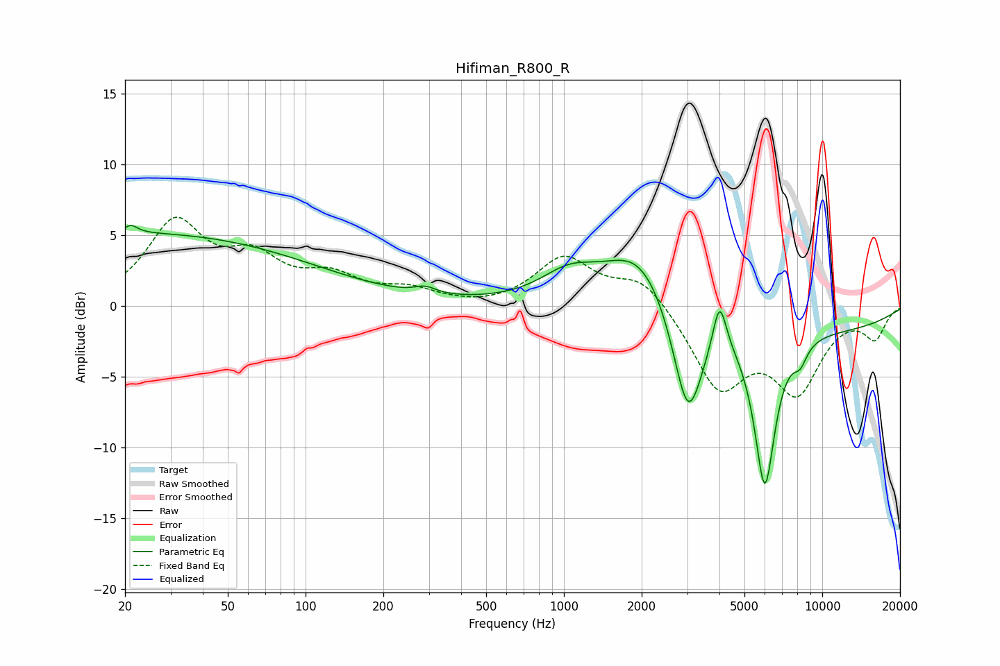

# Hifiman_R800_R
See [usage instructions](https://github.com/jaakkopasanen/AutoEq#usage) for more options and info.

### Parametric EQs
Apply preamp of -5.8 dB when using parametric equalizer.

|   # | Type    |   Fc (Hz) |    Q |   Gain (dB) |
|-----|---------|-----------|------|-------------|
|   1 | Peaking |        21 | 5.71 |         0.6 |
|   2 | Peaking |        21 | 0.18 |         5.1 |
|   3 | Peaking |       291 | 3.45 |         0.5 |
|   4 | Peaking |      1048 | 1.27 |         1.9 |
|   5 | Peaking |      1982 | 1.04 |         4.2 |
|   6 | Peaking |      3020 | 2.34 |        -8.3 |
|   7 | Peaking |      4005 | 5.33 |         3.6 |
|   8 | Peaking |      5992 | 3.3  |       -11.1 |
|   9 | Peaking |      8218 | 4.86 |        -1.2 |
|  10 | Peaking |     10000 | 0.31 |        -1.6 |

### Fixed Band EQs
When using fixed band (also called graphic) equalizer, apply preamp of **-6.4 dB** (if available) and set gains manually with these parameters.

|   # | Type    |   Fc (Hz) |    Q |   Gain (dB) |
|-----|---------|-----------|------|-------------|
|   1 | Peaking |        31 | 1.41 |         5.7 |
|   2 | Peaking |        62 | 1.41 |         2.9 |
|   3 | Peaking |       125 | 1.41 |         1.8 |
|   4 | Peaking |       250 | 1.41 |         1   |
|   5 | Peaking |       500 | 1.41 |        -0.2 |
|   6 | Peaking |      1000 | 1.41 |         3.3 |
|   7 | Peaking |      2000 | 1.41 |         2.1 |
|   8 | Peaking |      4000 | 1.41 |        -5.6 |
|   9 | Peaking |      8000 | 1.41 |        -5.6 |
|  10 | Peaking |     16000 | 1.41 |        -2.1 |

### Graphs

