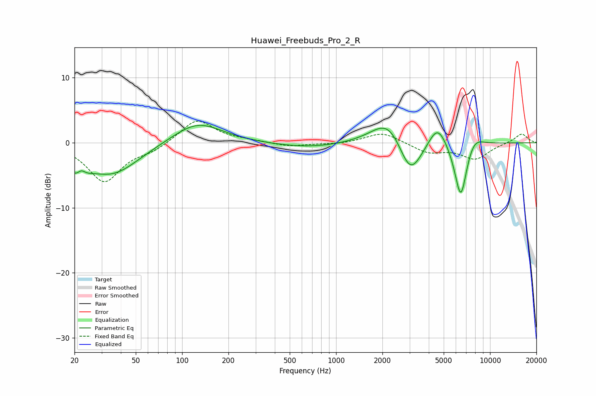

# Huawei_Freebuds_Pro_2_R
See [usage instructions](https://github.com/jaakkopasanen/AutoEq#usage) for more options and info.

### Parametric EQs
Apply preamp of -2.8 dB when using parametric equalizer.

|   # | Type    |   Fc (Hz) |    Q |   Gain (dB) |
|-----|---------|-----------|------|-------------|
|   1 | Peaking |        21 | 2.41 |        -3.3 |
|   2 | Peaking |        22 | 5.02 |         1.6 |
|   3 | Peaking |        35 | 0.82 |        -4.7 |
|   4 | Peaking |       126 | 0.88 |         3.3 |
|   5 | Peaking |       665 | 0.61 |        -0.8 |
|   6 | Peaking |      2219 | 1.28 |         4.6 |
|   7 | Peaking |      3022 | 1.78 |        -6.5 |
|   8 | Peaking |      4561 | 2.33 |         3.7 |
|   9 | Peaking |      6456 | 3.27 |        -9.2 |
|  10 | Peaking |      7793 | 2.27 |         2   |

### Fixed Band EQs
When using fixed band (also called graphic) equalizer, apply preamp of **-3.4 dB** (if available) and set gains manually with these parameters.

|   # | Type    |   Fc (Hz) |    Q |   Gain (dB) |
|-----|---------|-----------|------|-------------|
|   1 | Peaking |        31 | 1.41 |        -5.9 |
|   2 | Peaking |        62 | 1.41 |        -1   |
|   3 | Peaking |       125 | 1.41 |         3.7 |
|   4 | Peaking |       250 | 1.41 |         0.3 |
|   5 | Peaking |       500 | 1.41 |        -0.6 |
|   6 | Peaking |      1000 | 1.41 |        -0.2 |
|   7 | Peaking |      2000 | 1.41 |         1.7 |
|   8 | Peaking |      4000 | 1.41 |        -1.5 |
|   9 | Peaking |      8000 | 1.41 |        -2.4 |
|  10 | Peaking |     16000 | 1.41 |         1.5 |

### Graphs

