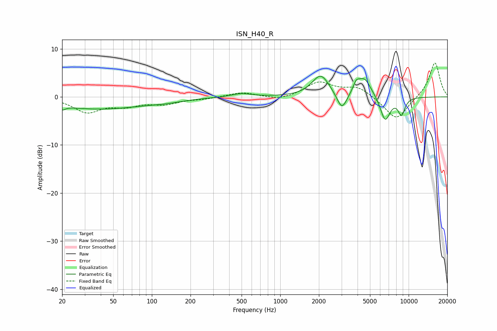

# ISN_H40_R
See [usage instructions](https://github.com/jaakkopasanen/AutoEq#usage) for more options and info.

### Parametric EQs
Apply preamp of -4.4 dB when using parametric equalizer.

|   # | Type    |   Fc (Hz) |    Q |   Gain (dB) |
|-----|---------|-----------|------|-------------|
|   1 | Peaking |        20 | 5.9  |        -0.8 |
|   2 | Peaking |        39 | 0.39 |        -2.5 |
|   3 | Peaking |       130 | 1.12 |        -0.4 |
|   4 | Peaking |       500 | 1.83 |         0.7 |
|   5 | Peaking |      2065 | 2.1  |         4.5 |
|   6 | Peaking |      3022 | 3.58 |        -3.8 |
|   7 | Peaking |      3899 | 6    |         1.6 |
|   8 | Peaking |      4499 | 2.5  |         4   |
|   9 | Peaking |      6564 | 3.49 |        -5.2 |
|  10 | Peaking |      8799 | 4.93 |        -3.5 |

### Fixed Band EQs
When using fixed band (also called graphic) equalizer, apply preamp of **-7.1 dB** (if available) and set gains manually with these parameters.

|   # | Type    |   Fc (Hz) |    Q |   Gain (dB) |
|-----|---------|-----------|------|-------------|
|   1 | Peaking |        31 | 1.41 |        -3   |
|   2 | Peaking |        62 | 1.41 |        -1.6 |
|   3 | Peaking |       125 | 1.41 |        -1.3 |
|   4 | Peaking |       250 | 1.41 |        -0.4 |
|   5 | Peaking |       500 | 1.41 |         1   |
|   6 | Peaking |      1000 | 1.41 |        -0.8 |
|   7 | Peaking |      2000 | 1.41 |         3   |
|   8 | Peaking |      4000 | 1.41 |         2   |
|   9 | Peaking |      8000 | 1.41 |        -4.9 |
|  10 | Peaking |     16000 | 1.41 |         7.3 |

### Graphs

