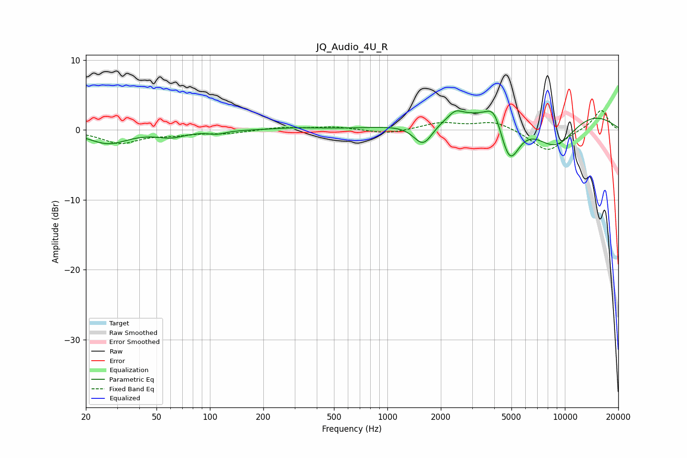

# JQ_Audio_4U_R
See [usage instructions](https://github.com/jaakkopasanen/AutoEq#usage) for more options and info.

### Parametric EQs
Apply preamp of -2.8 dB when using parametric equalizer.

|   # | Type    |   Fc (Hz) |    Q |   Gain (dB) |
|-----|---------|-----------|------|-------------|
|   1 | Peaking |        27 | 1.32 |        -1.9 |
|   2 | Peaking |        61 | 1.85 |        -0.9 |
|   3 | Peaking |       110 | 3.04 |        -0.4 |
|   4 | Peaking |       303 | 1.11 |         0.3 |
|   5 | Peaking |      1593 | 2.54 |        -3.4 |
|   6 | Peaking |      2420 | 3.89 |         1   |
|   7 | Peaking |      4000 | 3.17 |         2.8 |
|   8 | Peaking |      4872 | 2.33 |        -7.1 |
|   9 | Peaking |      7341 | 0.29 |         5.6 |
|  10 | Peaking |      8730 | 0.89 |        -7.1 |

### Fixed Band EQs
When using fixed band (also called graphic) equalizer, apply preamp of **-2.9 dB** (if available) and set gains manually with these parameters.

|   # | Type    |   Fc (Hz) |    Q |   Gain (dB) |
|-----|---------|-----------|------|-------------|
|   1 | Peaking |        31 | 1.41 |        -1.8 |
|   2 | Peaking |        62 | 1.41 |        -0.5 |
|   3 | Peaking |       125 | 1.41 |        -0.5 |
|   4 | Peaking |       250 | 1.41 |         0.4 |
|   5 | Peaking |       500 | 1.41 |         0.4 |
|   6 | Peaking |      1000 | 1.41 |        -0.6 |
|   7 | Peaking |      2000 | 1.41 |         1   |
|   8 | Peaking |      4000 | 1.41 |         1.3 |
|   9 | Peaking |      8000 | 1.41 |        -3.1 |
|  10 | Peaking |     16000 | 1.41 |         2.9 |

### Graphs

