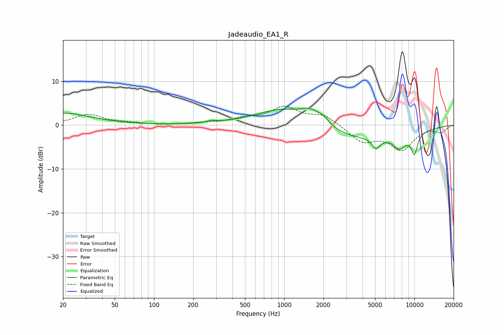

# Jadeaudio_EA1_R
See [usage instructions](https://github.com/jaakkopasanen/AutoEq#usage) for more options and info.

### Parametric EQs
Apply preamp of -3.9 dB when using parametric equalizer.

|   # | Type    |   Fc (Hz) |    Q |   Gain (dB) |
|-----|---------|-----------|------|-------------|
|   1 | Peaking |        20 | 0.66 |         2.7 |
|   2 | Peaking |       277 | 4.01 |         0.4 |
|   3 | Peaking |      1013 | 0.63 |         5.3 |
|   4 | Peaking |      1610 | 1.79 |         2.7 |
|   5 | Peaking |      2004 | 3.02 |         1.3 |
|   6 | Peaking |      2956 | 0.28 |        -3.7 |
|   7 | Peaking |      5113 | 5.25 |        -4.6 |
|   8 | Peaking |      5137 | 5.85 |         2.3 |
|   9 | Peaking |      7703 | 2.82 |        -2.8 |
|  10 | Peaking |     10000 | 4.95 |        -4.5 |

### Fixed Band EQs
When using fixed band (also called graphic) equalizer, apply preamp of **-4.4 dB** (if available) and set gains manually with these parameters.

|   # | Type    |   Fc (Hz) |    Q |   Gain (dB) |
|-----|---------|-----------|------|-------------|
|   1 | Peaking |        31 | 1.41 |         2.4 |
|   2 | Peaking |        62 | 1.41 |         0.4 |
|   3 | Peaking |       125 | 1.41 |        -0   |
|   4 | Peaking |       250 | 1.41 |         0.4 |
|   5 | Peaking |       500 | 1.41 |         1.2 |
|   6 | Peaking |      1000 | 1.41 |         3.8 |
|   7 | Peaking |      2000 | 1.41 |         2.2 |
|   8 | Peaking |      4000 | 1.41 |        -3.7 |
|   9 | Peaking |      8000 | 1.41 |        -5.3 |
|  10 | Peaking |     16000 | 1.41 |        -1.5 |

### Graphs

