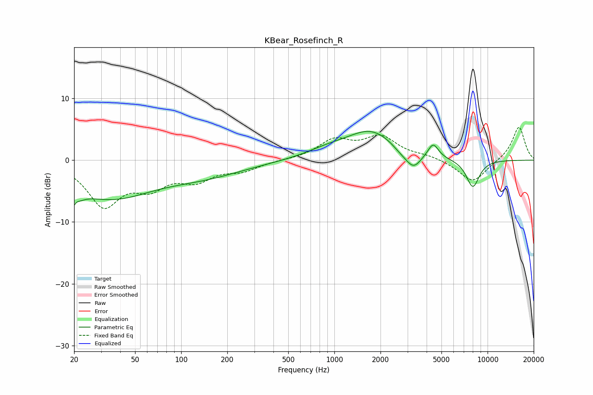

# KBear_Rosefinch_R
See [usage instructions](https://github.com/jaakkopasanen/AutoEq#usage) for more options and info.

### Parametric EQs
Apply preamp of -4.7 dB when using parametric equalizer.

|   # | Type    |   Fc (Hz) |    Q |   Gain (dB) |
|-----|---------|-----------|------|-------------|
|   1 | Peaking |        20 | 4.26 |        -5.8 |
|   2 | Peaking |        20 | 5.9  |         3.2 |
|   3 | Peaking |        34 | 0.5  |        -5.8 |
|   4 | Peaking |       143 | 0.53 |        -2.1 |
|   5 | Peaking |       889 | 0.98 |         1.1 |
|   6 | Peaking |      1742 | 0.86 |         4.6 |
|   7 | Peaking |      2701 | 2.48 |        -0.8 |
|   8 | Peaking |      3276 | 2.75 |        -2.6 |
|   9 | Peaking |      4410 | 4.01 |         2.4 |
|  10 | Peaking |      8008 | 3.02 |        -4.5 |

### Fixed Band EQs
When using fixed band (also called graphic) equalizer, apply preamp of **-5.4 dB** (if available) and set gains manually with these parameters.

|   # | Type    |   Fc (Hz) |    Q |   Gain (dB) |
|-----|---------|-----------|------|-------------|
|   1 | Peaking |        31 | 1.41 |        -7   |
|   2 | Peaking |        62 | 1.41 |        -3.6 |
|   3 | Peaking |       125 | 1.41 |        -2.8 |
|   4 | Peaking |       250 | 1.41 |        -1.5 |
|   5 | Peaking |       500 | 1.41 |         0   |
|   6 | Peaking |      1000 | 1.41 |         3   |
|   7 | Peaking |      2000 | 1.41 |         3.5 |
|   8 | Peaking |      4000 | 1.41 |         0.6 |
|   9 | Peaking |      8000 | 1.41 |        -3.7 |
|  10 | Peaking |     16000 | 1.41 |         5.5 |

### Graphs

