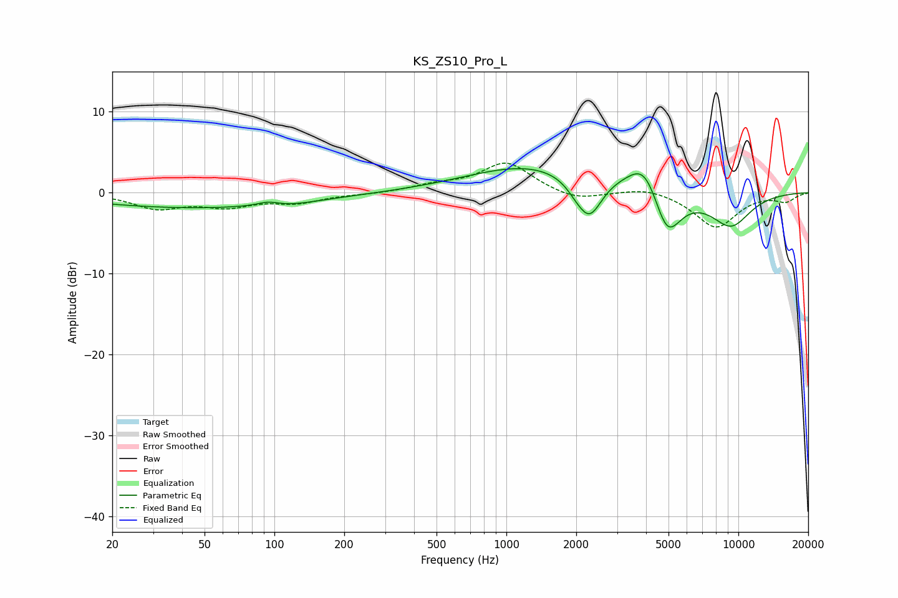

# KS_ZS10_Pro_L
See [usage instructions](https://github.com/jaakkopasanen/AutoEq#usage) for more options and info.

### Parametric EQs
Apply preamp of -3.1 dB when using parametric equalizer.

|   # | Type    |   Fc (Hz) |    Q |   Gain (dB) |
|-----|---------|-----------|------|-------------|
|   1 | Peaking |        47 | 0.29 |        -1.9 |
|   2 | Peaking |        94 | 3.13 |         0.5 |
|   3 | Peaking |       118 | 1.5  |        -0.3 |
|   4 | Peaking |      1275 | 0.52 |         3.4 |
|   5 | Peaking |      2023 | 2.82 |        -1.2 |
|   6 | Peaking |      2293 | 2.68 |        -4.5 |
|   7 | Peaking |      3215 | 1.37 |         0.4 |
|   8 | Peaking |      3956 | 2.05 |         4.1 |
|   9 | Peaking |      4924 | 2.3  |        -6.1 |
|  10 | Peaking |      9274 | 1.43 |        -4.1 |

### Fixed Band EQs
When using fixed band (also called graphic) equalizer, apply preamp of **-3.7 dB** (if available) and set gains manually with these parameters.

|   # | Type    |   Fc (Hz) |    Q |   Gain (dB) |
|-----|---------|-----------|------|-------------|
|   1 | Peaking |        31 | 1.41 |        -1.8 |
|   2 | Peaking |        62 | 1.41 |        -1.5 |
|   3 | Peaking |       125 | 1.41 |        -1.1 |
|   4 | Peaking |       250 | 1.41 |        -0.2 |
|   5 | Peaking |       500 | 1.41 |         0.8 |
|   6 | Peaking |      1000 | 1.41 |         3.7 |
|   7 | Peaking |      2000 | 1.41 |        -1.1 |
|   8 | Peaking |      4000 | 1.41 |         0.8 |
|   9 | Peaking |      8000 | 1.41 |        -4.3 |
|  10 | Peaking |     16000 | 1.41 |        -1   |

### Graphs

