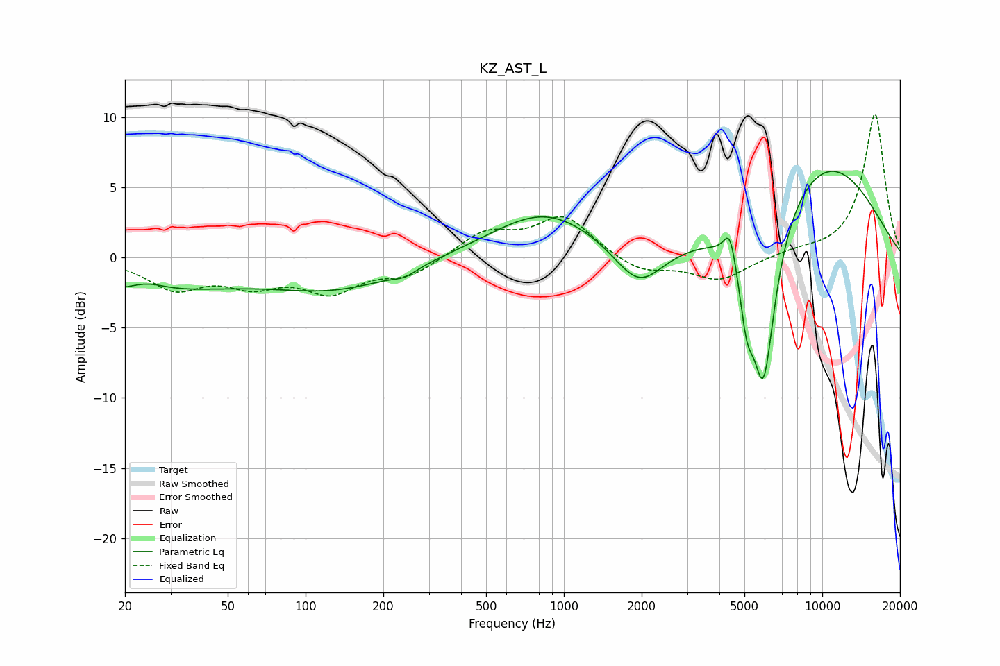

# KZ_AST_L
See [usage instructions](https://github.com/jaakkopasanen/AutoEq#usage) for more options and info.

### Parametric EQs
Apply preamp of -6.2 dB when using parametric equalizer.

|   # | Type    |   Fc (Hz) |    Q |   Gain (dB) |
|-----|---------|-----------|------|-------------|
|   1 | Peaking |        21 | 0.35 |        -2.4 |
|   2 | Peaking |        24 | 1.97 |         0.6 |
|   3 | Peaking |       135 | 0.57 |        -2   |
|   4 | Peaking |       242 | 3.01 |        -0.5 |
|   5 | Peaking |       844 | 0.68 |         3.3 |
|   6 | Peaking |      1951 | 1.48 |        -3.1 |
|   7 | Peaking |      4393 | 6    |         2.3 |
|   8 | Peaking |      5103 | 5.27 |        -3.6 |
|   9 | Peaking |      5922 | 2.81 |       -12.5 |
|  10 | Peaking |     10000 | 0.48 |         6.9 |

### Fixed Band EQs
When using fixed band (also called graphic) equalizer, apply preamp of **-10.3 dB** (if available) and set gains manually with these parameters.

|   # | Type    |   Fc (Hz) |    Q |   Gain (dB) |
|-----|---------|-----------|------|-------------|
|   1 | Peaking |        31 | 1.41 |        -2.1 |
|   2 | Peaking |        62 | 1.41 |        -1.6 |
|   3 | Peaking |       125 | 1.41 |        -2.2 |
|   4 | Peaking |       250 | 1.41 |        -1.2 |
|   5 | Peaking |       500 | 1.41 |         1.8 |
|   6 | Peaking |      1000 | 1.41 |         2.9 |
|   7 | Peaking |      2000 | 1.41 |        -1.1 |
|   8 | Peaking |      4000 | 1.41 |        -1.6 |
|   9 | Peaking |      8000 | 1.41 |         0.4 |
|  10 | Peaking |     16000 | 1.41 |        10.3 |

### Graphs

