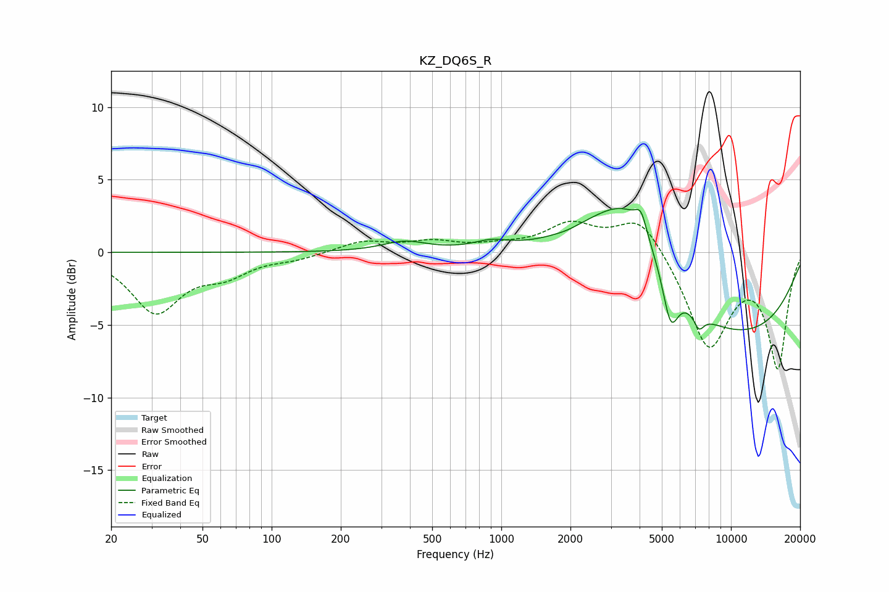

# KZ_DQ6S_R
See [usage instructions](https://github.com/jaakkopasanen/AutoEq#usage) for more options and info.

### Parametric EQs
Apply preamp of -3.1 dB when using parametric equalizer.

|   # | Type    |   Fc (Hz) |    Q |   Gain (dB) |
|-----|---------|-----------|------|-------------|
|   1 | Peaking |       380 | 1.49 |         0.7 |
|   2 | Peaking |       906 | 1.82 |         0.5 |
|   3 | Peaking |      1942 | 3.21 |        -0.1 |
|   4 | Peaking |      2759 | 0.68 |         1.1 |
|   5 | Peaking |      3401 | 0.74 |         3.8 |
|   6 | Peaking |      3722 | 1.25 |         1.9 |
|   7 | Peaking |      4058 | 5.79 |         1.3 |
|   8 | Peaking |      5458 | 4.14 |        -3.3 |
|   9 | Peaking |      7251 | 5.99 |        -1   |
|  10 | Peaking |      9216 | 0.28 |        -6   |

### Fixed Band EQs
When using fixed band (also called graphic) equalizer, apply preamp of **-2.2 dB** (if available) and set gains manually with these parameters.

|   # | Type    |   Fc (Hz) |    Q |   Gain (dB) |
|-----|---------|-----------|------|-------------|
|   1 | Peaking |        31 | 1.41 |        -4   |
|   2 | Peaking |        62 | 1.41 |        -1.3 |
|   3 | Peaking |       125 | 1.41 |        -0.4 |
|   4 | Peaking |       250 | 1.41 |         0.8 |
|   5 | Peaking |       500 | 1.41 |         0.6 |
|   6 | Peaking |      1000 | 1.41 |         0.3 |
|   7 | Peaking |      2000 | 1.41 |         1.8 |
|   8 | Peaking |      4000 | 1.41 |         2.6 |
|   9 | Peaking |      8000 | 1.41 |        -6.5 |
|  10 | Peaking |     16000 | 1.41 |        -7.8 |

### Graphs

