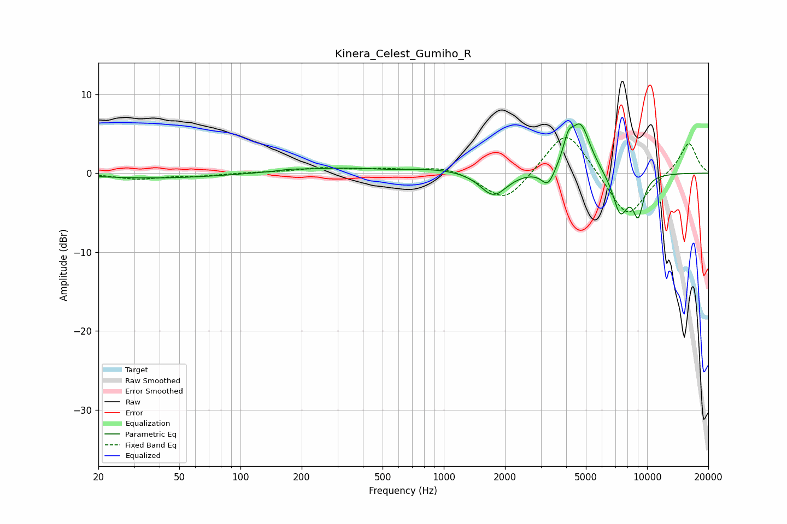

# Kinera_Celest_Gumiho_R
See [usage instructions](https://github.com/jaakkopasanen/AutoEq#usage) for more options and info.

### Parametric EQs
Apply preamp of -6.3 dB when using parametric equalizer.

|   # | Type    |   Fc (Hz) |    Q |   Gain (dB) |
|-----|---------|-----------|------|-------------|
|   1 | Peaking |        63 | 0.33 |        -1.1 |
|   2 | Peaking |       176 | 3.17 |         0.2 |
|   3 | Peaking |       290 | 0.18 |         1.1 |
|   4 | Peaking |       542 | 1.19 |        -0.3 |
|   5 | Peaking |      1755 | 2.11 |        -3.2 |
|   6 | Peaking |      3258 | 4.39 |        -2.2 |
|   7 | Peaking |      4093 | 5.88 |         2.5 |
|   8 | Peaking |      4706 | 2.8  |         6.2 |
|   9 | Peaking |      7383 | 3.46 |        -5.1 |
|  10 | Peaking |      9040 | 4.79 |        -4.7 |

### Fixed Band EQs
When using fixed band (also called graphic) equalizer, apply preamp of **-4.6 dB** (if available) and set gains manually with these parameters.

|   # | Type    |   Fc (Hz) |    Q |   Gain (dB) |
|-----|---------|-----------|------|-------------|
|   1 | Peaking |        31 | 1.41 |        -0.7 |
|   2 | Peaking |        62 | 1.41 |        -0.3 |
|   3 | Peaking |       125 | 1.41 |         0.1 |
|   4 | Peaking |       250 | 1.41 |         0.6 |
|   5 | Peaking |       500 | 1.41 |         0.4 |
|   6 | Peaking |      1000 | 1.41 |         0.9 |
|   7 | Peaking |      2000 | 1.41 |        -3.9 |
|   8 | Peaking |      4000 | 1.41 |         6   |
|   9 | Peaking |      8000 | 1.41 |        -5.9 |
|  10 | Peaking |     16000 | 1.41 |         4   |

### Graphs

