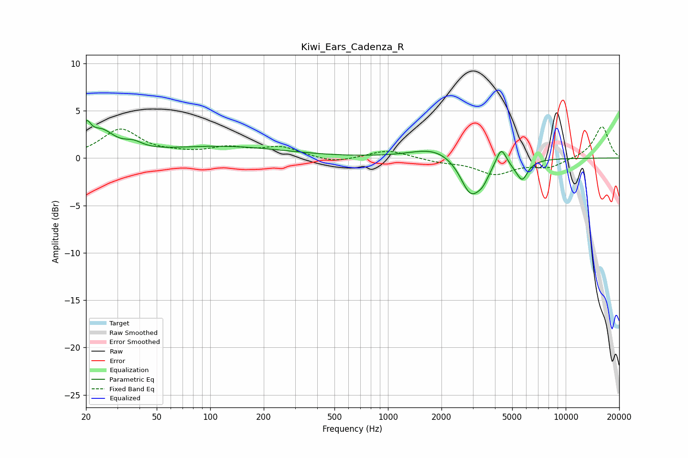

# Kiwi_Ears_Cadenza_R
See [usage instructions](https://github.com/jaakkopasanen/AutoEq#usage) for more options and info.

### Parametric EQs
Apply preamp of -4.1 dB when using parametric equalizer.

|   # | Type    |   Fc (Hz) |    Q |   Gain (dB) |
|-----|---------|-----------|------|-------------|
|   1 | Peaking |        20 | 5.84 |         2.2 |
|   2 | Peaking |        24 | 1.95 |         2.4 |
|   3 | Peaking |        37 | 2.67 |         0.7 |
|   4 | Peaking |       116 | 0.4  |         1.2 |
|   5 | Peaking |      1832 | 1.1  |         1.2 |
|   6 | Peaking |      2913 | 2.45 |        -3.8 |
|   7 | Peaking |      3421 | 3.78 |        -1.2 |
|   8 | Peaking |      4340 | 5.04 |         1.9 |
|   9 | Peaking |      5443 | 2.71 |        -0.8 |
|  10 | Peaking |      5712 | 4.93 |        -1.5 |

### Fixed Band EQs
When using fixed band (also called graphic) equalizer, apply preamp of **-3.4 dB** (if available) and set gains manually with these parameters.

|   # | Type    |   Fc (Hz) |    Q |   Gain (dB) |
|-----|---------|-----------|------|-------------|
|   1 | Peaking |        31 | 1.41 |         3   |
|   2 | Peaking |        62 | 1.41 |         0.3 |
|   3 | Peaking |       125 | 1.41 |         0.9 |
|   4 | Peaking |       250 | 1.41 |         1.1 |
|   5 | Peaking |       500 | 1.41 |        -0.5 |
|   6 | Peaking |      1000 | 1.41 |         0.9 |
|   7 | Peaking |      2000 | 1.41 |        -0.4 |
|   8 | Peaking |      4000 | 1.41 |        -1.6 |
|   9 | Peaking |      8000 | 1.41 |        -0.9 |
|  10 | Peaking |     16000 | 1.41 |         3.4 |

### Graphs

