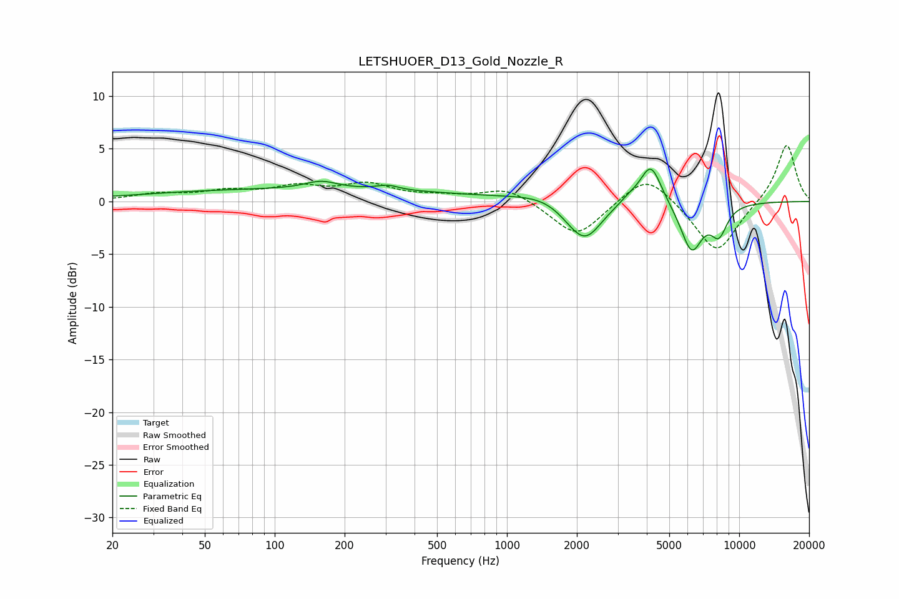

# LETSHUOER_D13_Gold_Nozzle_R
See [usage instructions](https://github.com/jaakkopasanen/AutoEq#usage) for more options and info.

### Parametric EQs
Apply preamp of -3.2 dB when using parametric equalizer.

|   # | Type    |   Fc (Hz) |    Q |   Gain (dB) |
|-----|---------|-----------|------|-------------|
|   1 | Peaking |       129 | 0.18 |         1.2 |
|   2 | Peaking |       158 | 2.07 |         0.7 |
|   3 | Peaking |       306 | 3.15 |         0.4 |
|   4 | Peaking |      1468 | 1.05 |         0.7 |
|   5 | Peaking |      1912 | 1.97 |        -0.8 |
|   6 | Peaking |      2189 | 2    |        -3.3 |
|   7 | Peaking |      3357 | 3.39 |         0.5 |
|   8 | Peaking |      4165 | 3.05 |         3.9 |
|   9 | Peaking |      6235 | 2.88 |        -4.6 |
|  10 | Peaking |      8179 | 3.71 |        -2.6 |

### Fixed Band EQs
When using fixed band (also called graphic) equalizer, apply preamp of **-5.4 dB** (if available) and set gains manually with these parameters.

|   # | Type    |   Fc (Hz) |    Q |   Gain (dB) |
|-----|---------|-----------|------|-------------|
|   1 | Peaking |        31 | 1.41 |         0.6 |
|   2 | Peaking |        62 | 1.41 |         0.8 |
|   3 | Peaking |       125 | 1.41 |         1.2 |
|   4 | Peaking |       250 | 1.41 |         1.5 |
|   5 | Peaking |       500 | 1.41 |         0.4 |
|   6 | Peaking |      1000 | 1.41 |         1.3 |
|   7 | Peaking |      2000 | 1.41 |        -3.4 |
|   8 | Peaking |      4000 | 1.41 |         2.9 |
|   9 | Peaking |      8000 | 1.41 |        -5   |
|  10 | Peaking |     16000 | 1.41 |         5.6 |

### Graphs

