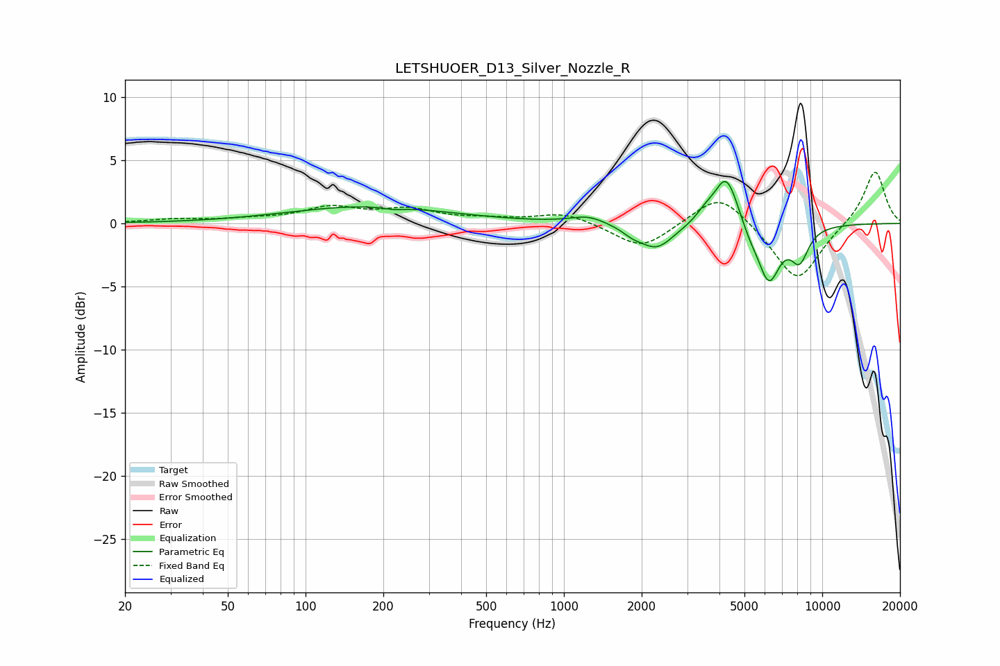

# LETSHUOER_D13_Silver_Nozzle_R
See [usage instructions](https://github.com/jaakkopasanen/AutoEq#usage) for more options and info.

### Parametric EQs
Apply preamp of -3.4 dB when using parametric equalizer.

|   # | Type    |   Fc (Hz) |    Q |   Gain (dB) |
|-----|---------|-----------|------|-------------|
|   1 | Peaking |       175 | 0.46 |         1.3 |
|   2 | Peaking |       219 | 3.56 |        -0.2 |
|   3 | Peaking |      1240 | 2.09 |         0.6 |
|   4 | Peaking |      1839 | 3.63 |        -0.4 |
|   5 | Peaking |      2282 | 2.08 |        -2   |
|   6 | Peaking |      3528 | 3.8  |         0.7 |
|   7 | Peaking |      4253 | 2.99 |         4.1 |
|   8 | Peaking |      5238 | 4.17 |        -0.7 |
|   9 | Peaking |      6210 | 3.12 |        -4.5 |
|  10 | Peaking |      8168 | 3.76 |        -2.5 |

### Fixed Band EQs
When using fixed band (also called graphic) equalizer, apply preamp of **-4.2 dB** (if available) and set gains manually with these parameters.

|   # | Type    |   Fc (Hz) |    Q |   Gain (dB) |
|-----|---------|-----------|------|-------------|
|   1 | Peaking |        31 | 1.41 |         0.3 |
|   2 | Peaking |        62 | 1.41 |         0.3 |
|   3 | Peaking |       125 | 1.41 |         1.2 |
|   4 | Peaking |       250 | 1.41 |         1   |
|   5 | Peaking |       500 | 1.41 |         0.3 |
|   6 | Peaking |      1000 | 1.41 |         0.9 |
|   7 | Peaking |      2000 | 1.41 |        -2.1 |
|   8 | Peaking |      4000 | 1.41 |         2.6 |
|   9 | Peaking |      8000 | 1.41 |        -4.7 |
|  10 | Peaking |     16000 | 1.41 |         4.3 |

### Graphs

