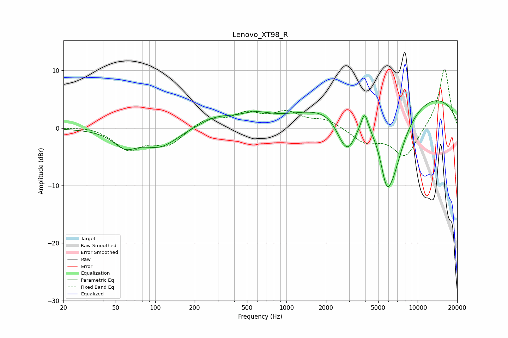

# Lenovo_XT98_R
See [usage instructions](https://github.com/jaakkopasanen/AutoEq#usage) for more options and info.

### Parametric EQs
Apply preamp of -4.8 dB when using parametric equalizer.

|   # | Type    |   Fc (Hz) |    Q |   Gain (dB) |
|-----|---------|-----------|------|-------------|
|   1 | Peaking |        59 | 1.61 |        -2.7 |
|   2 | Peaking |       109 | 1.06 |        -3.1 |
|   3 | Peaking |       290 | 1.04 |         1.7 |
|   4 | Peaking |       572 | 1.22 |         1.6 |
|   5 | Peaking |      2688 | 2.07 |        -2.9 |
|   6 | Peaking |      2990 | 2.22 |        -4.6 |
|   7 | Peaking |      3935 | 5.57 |         3.1 |
|   8 | Peaking |      5768 | 3.37 |        -5.2 |
|   9 | Peaking |      6401 | 1.25 |       -12.9 |
|  10 | Peaking |      7180 | 0.19 |         7.4 |

### Fixed Band EQs
When using fixed band (also called graphic) equalizer, apply preamp of **-10.3 dB** (if available) and set gains manually with these parameters.

|   # | Type    |   Fc (Hz) |    Q |   Gain (dB) |
|-----|---------|-----------|------|-------------|
|   1 | Peaking |        31 | 1.41 |         0.4 |
|   2 | Peaking |        62 | 1.41 |        -3.6 |
|   3 | Peaking |       125 | 1.41 |        -2.8 |
|   4 | Peaking |       250 | 1.41 |         1.7 |
|   5 | Peaking |       500 | 1.41 |         2.3 |
|   6 | Peaking |      1000 | 1.41 |         2.4 |
|   7 | Peaking |      2000 | 1.41 |         1.4 |
|   8 | Peaking |      4000 | 1.41 |        -2.4 |
|   9 | Peaking |      8000 | 1.41 |        -5.1 |
|  10 | Peaking |     16000 | 1.41 |        10.6 |

### Graphs

