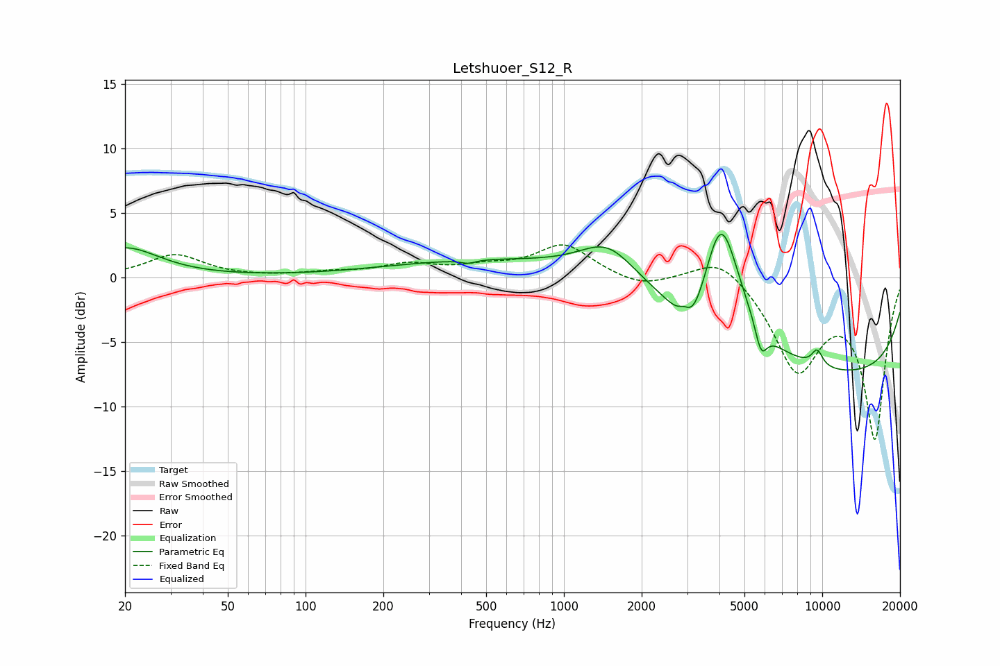

# Letshuoer_S12_R
See [usage instructions](https://github.com/jaakkopasanen/AutoEq#usage) for more options and info.

### Parametric EQs
Apply preamp of -3.4 dB when using parametric equalizer.

|   # | Type    |   Fc (Hz) |    Q |   Gain (dB) |
|-----|---------|-----------|------|-------------|
|   1 | Peaking |        20 | 1.08 |         2.3 |
|   2 | Peaking |       427 | 5.4  |        -0.3 |
|   3 | Peaking |      1140 | 0.18 |         1.7 |
|   4 | Peaking |      1484 | 1.28 |         2.8 |
|   5 | Peaking |      2921 | 5.97 |         0.8 |
|   6 | Peaking |      3098 | 2.2  |        -4   |
|   7 | Peaking |      4054 | 1.89 |         9.7 |
|   8 | Peaking |      5799 | 5.98 |        -2.2 |
|   9 | Peaking |      9558 | 5.78 |         1.3 |
|  10 | Peaking |     10000 | 0.18 |        -7.8 |

### Fixed Band EQs
When using fixed band (also called graphic) equalizer, apply preamp of **-2.6 dB** (if available) and set gains manually with these parameters.

|   # | Type    |   Fc (Hz) |    Q |   Gain (dB) |
|-----|---------|-----------|------|-------------|
|   1 | Peaking |        31 | 1.41 |         1.7 |
|   2 | Peaking |        62 | 1.41 |        -0   |
|   3 | Peaking |       125 | 1.41 |         0.3 |
|   4 | Peaking |       250 | 1.41 |         0.9 |
|   5 | Peaking |       500 | 1.41 |         0.6 |
|   6 | Peaking |      1000 | 1.41 |         2.5 |
|   7 | Peaking |      2000 | 1.41 |        -0.8 |
|   8 | Peaking |      4000 | 1.41 |         1.9 |
|   9 | Peaking |      8000 | 1.41 |        -6.9 |
|  10 | Peaking |     16000 | 1.41 |       -12.3 |

### Graphs

