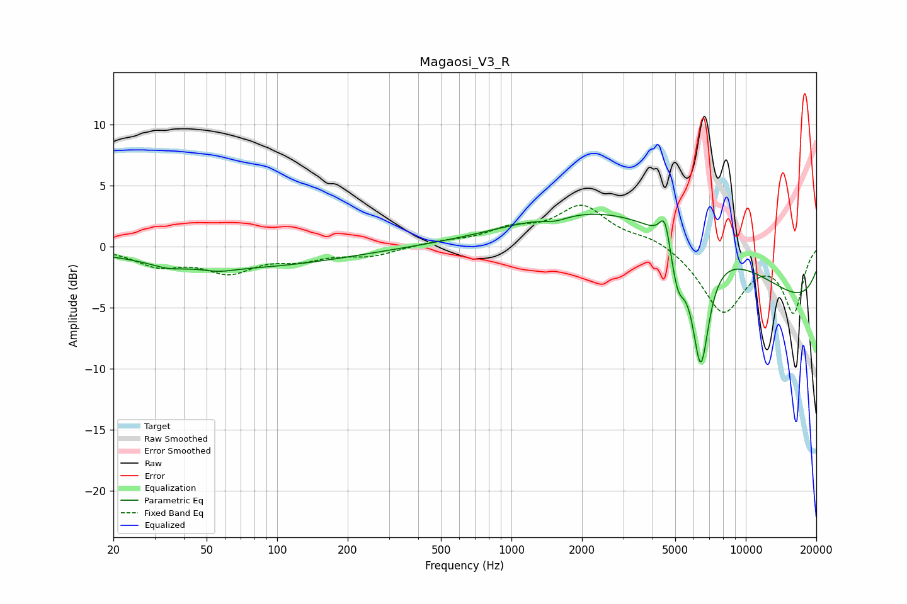

# Magaosi_V3_R
See [usage instructions](https://github.com/jaakkopasanen/AutoEq#usage) for more options and info.

### Parametric EQs
Apply preamp of -2.7 dB when using parametric equalizer.

|   # | Type    |   Fc (Hz) |    Q |   Gain (dB) |
|-----|---------|-----------|------|-------------|
|   1 | Peaking |        34 | 2.11 |        -0.4 |
|   2 | Peaking |        56 | 2.15 |        -0.3 |
|   3 | Peaking |        69 | 0.33 |        -1.7 |
|   4 | Peaking |      1540 | 2.57 |        -0.4 |
|   5 | Peaking |      3234 | 0.32 |         3.5 |
|   6 | Peaking |      4523 | 5.99 |         2.6 |
|   7 | Peaking |      5121 | 4.36 |        -3.4 |
|   8 | Peaking |      5725 | 0.27 |         4.2 |
|   9 | Peaking |      6422 | 3.63 |        -9.8 |
|  10 | Peaking |     10000 | 0.18 |        -6.5 |

### Fixed Band EQs
When using fixed band (also called graphic) equalizer, apply preamp of **-3.5 dB** (if available) and set gains manually with these parameters.

|   # | Type    |   Fc (Hz) |    Q |   Gain (dB) |
|-----|---------|-----------|------|-------------|
|   1 | Peaking |        31 | 1.41 |        -1.4 |
|   2 | Peaking |        62 | 1.41 |        -1.9 |
|   3 | Peaking |       125 | 1.41 |        -0.9 |
|   4 | Peaking |       250 | 1.41 |        -0.7 |
|   5 | Peaking |       500 | 1.41 |         0.3 |
|   6 | Peaking |      1000 | 1.41 |         1.2 |
|   7 | Peaking |      2000 | 1.41 |         3.2 |
|   8 | Peaking |      4000 | 1.41 |         0.8 |
|   9 | Peaking |      8000 | 1.41 |        -5.3 |
|  10 | Peaking |     16000 | 1.41 |        -5.2 |

### Graphs

