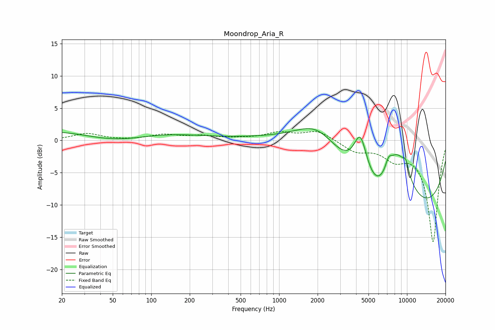

# Moondrop_Aria_R
See [usage instructions](https://github.com/jaakkopasanen/AutoEq#usage) for more options and info.

### Parametric EQs
Apply preamp of -1.9 dB when using parametric equalizer.

|   # | Type    |   Fc (Hz) |    Q |   Gain (dB) |
|-----|---------|-----------|------|-------------|
|   1 | Peaking |        39 | 0.18 |         2   |
|   2 | Peaking |        52 | 0.57 |        -1.8 |
|   3 | Peaking |      1991 | 0.84 |         4.5 |
|   4 | Peaking |      3659 | 0.23 |         5.5 |
|   5 | Peaking |      4319 | 2.69 |         6.4 |
|   6 | Peaking |      5928 | 1.44 |        -2.5 |
|   7 | Peaking |      7172 | 5.58 |         1.4 |
|   8 | Peaking |      8066 | 0.22 |       -16.5 |
|   9 | Peaking |      8321 | 1.09 |         9.8 |
|  10 | Peaking |      9803 | 5.32 |         1.7 |

### Fixed Band EQs
When using fixed band (also called graphic) equalizer, apply preamp of **-1.5 dB** (if available) and set gains manually with these parameters.

|   # | Type    |   Fc (Hz) |    Q |   Gain (dB) |
|-----|---------|-----------|------|-------------|
|   1 | Peaking |        31 | 1.41 |         1   |
|   2 | Peaking |        62 | 1.41 |        -0   |
|   3 | Peaking |       125 | 1.41 |         0.8 |
|   4 | Peaking |       250 | 1.41 |         0.6 |
|   5 | Peaking |       500 | 1.41 |         0.2 |
|   6 | Peaking |      1000 | 1.41 |         1.1 |
|   7 | Peaking |      2000 | 1.41 |         1.5 |
|   8 | Peaking |      4000 | 1.41 |        -1.6 |
|   9 | Peaking |      8000 | 1.41 |        -2.3 |
|  10 | Peaking |     16000 | 1.41 |       -15.7 |

### Graphs

