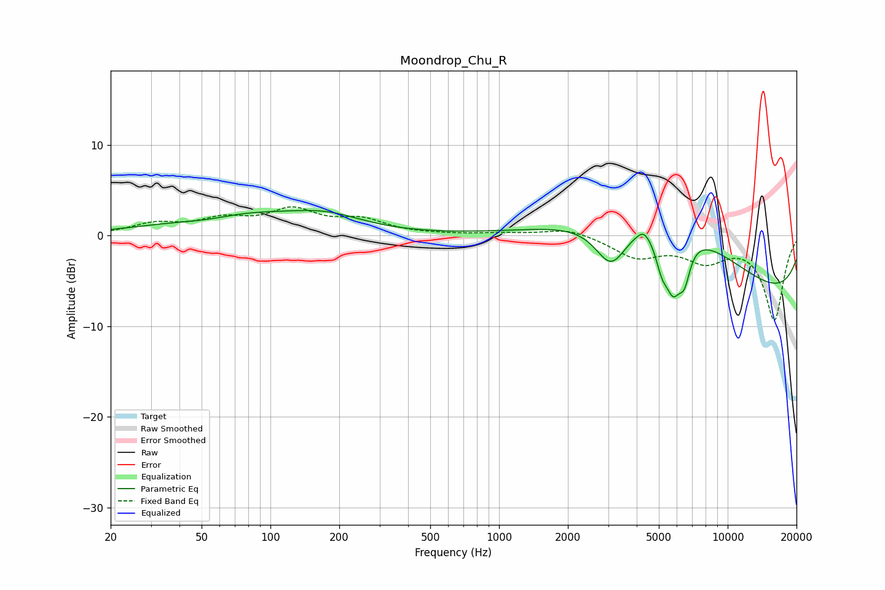

# Moondrop_Chu_R
See [usage instructions](https://github.com/jaakkopasanen/AutoEq#usage) for more options and info.

### Parametric EQs
Apply preamp of -2.9 dB when using parametric equalizer.

|   # | Type    |   Fc (Hz) |    Q |   Gain (dB) |
|-----|---------|-----------|------|-------------|
|   1 | Peaking |        54 | 0.84 |        -1.7 |
|   2 | Peaking |        62 | 0.56 |         3.4 |
|   3 | Peaking |       176 | 0.86 |         1.7 |
|   4 | Peaking |      3095 | 2    |        -5   |
|   5 | Peaking |      4284 | 5.27 |         0.8 |
|   6 | Peaking |      4970 | 0.39 |         9.5 |
|   7 | Peaking |      5156 | 4.73 |        -3.2 |
|   8 | Peaking |      5774 | 4.08 |        -5.3 |
|   9 | Peaking |      6462 | 5.06 |        -3.8 |
|  10 | Peaking |     10000 | 0.18 |        -8.1 |

### Fixed Band EQs
When using fixed band (also called graphic) equalizer, apply preamp of **-3.3 dB** (if available) and set gains manually with these parameters.

|   # | Type    |   Fc (Hz) |    Q |   Gain (dB) |
|-----|---------|-----------|------|-------------|
|   1 | Peaking |        31 | 1.41 |         1.2 |
|   2 | Peaking |        62 | 1.41 |         1.5 |
|   3 | Peaking |       125 | 1.41 |         2.6 |
|   4 | Peaking |       250 | 1.41 |         1.5 |
|   5 | Peaking |       500 | 1.41 |         0.1 |
|   6 | Peaking |      1000 | 1.41 |         0.2 |
|   7 | Peaking |      2000 | 1.41 |         0.9 |
|   8 | Peaking |      4000 | 1.41 |        -2.2 |
|   9 | Peaking |      8000 | 1.41 |        -2.5 |
|  10 | Peaking |     16000 | 1.41 |        -9.2 |

### Graphs

