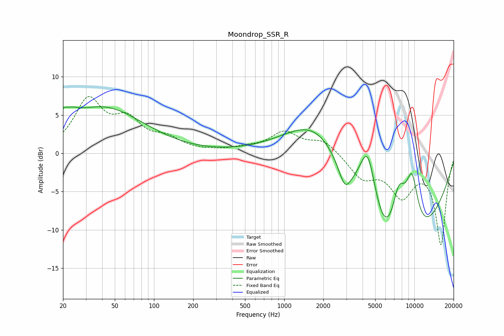

# Moondrop_SSR_R
See [usage instructions](https://github.com/jaakkopasanen/AutoEq#usage) for more options and info.

### Parametric EQs
Apply preamp of -6.2 dB when using parametric equalizer.

|   # | Type    |   Fc (Hz) |    Q |   Gain (dB) |
|-----|---------|-----------|------|-------------|
|   1 | Peaking |        20 | 5.8  |         1   |
|   2 | Peaking |        23 | 2.48 |         1.1 |
|   3 | Peaking |        40 | 0.45 |         5.9 |
|   4 | Peaking |      1481 | 0.6  |         1.8 |
|   5 | Peaking |      1960 | 0.58 |         7.4 |
|   6 | Peaking |      2924 | 3.02 |        -2.9 |
|   7 | Peaking |      4382 | 1.87 |        10.4 |
|   8 | Peaking |      6574 | 0.4  |       -20   |
|   9 | Peaking |      7581 | 1.93 |         9.6 |
|  10 | Peaking |      9569 | 2.47 |         7.8 |

### Fixed Band EQs
When using fixed band (also called graphic) equalizer, apply preamp of **-7.5 dB** (if available) and set gains manually with these parameters.

|   # | Type    |   Fc (Hz) |    Q |   Gain (dB) |
|-----|---------|-----------|------|-------------|
|   1 | Peaking |        31 | 1.41 |         6.7 |
|   2 | Peaking |        62 | 1.41 |         3.7 |
|   3 | Peaking |       125 | 1.41 |         1.6 |
|   4 | Peaking |       250 | 1.41 |         0.1 |
|   5 | Peaking |       500 | 1.41 |         0.5 |
|   6 | Peaking |      1000 | 1.41 |         2.6 |
|   7 | Peaking |      2000 | 1.41 |         1.7 |
|   8 | Peaking |      4000 | 1.41 |        -3   |
|   9 | Peaking |      8000 | 1.41 |        -5   |
|  10 | Peaking |     16000 | 1.41 |       -11.7 |

### Graphs

