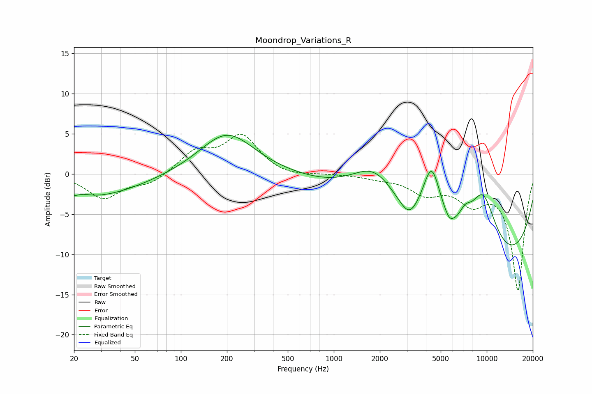

# Moondrop_Variations_R
See [usage instructions](https://github.com/jaakkopasanen/AutoEq#usage) for more options and info.

### Parametric EQs
Apply preamp of -4.9 dB when using parametric equalizer.

|   # | Type    |   Fc (Hz) |    Q |   Gain (dB) |
|-----|---------|-----------|------|-------------|
|   1 | Peaking |        21 | 0.36 |        -3.2 |
|   2 | Peaking |        23 | 2.56 |         0.5 |
|   3 | Peaking |       200 | 0.79 |         5.2 |
|   4 | Peaking |      1892 | 0.82 |         6.9 |
|   5 | Peaking |      3097 | 2.7  |        -1.5 |
|   6 | Peaking |      4365 | 2.06 |         9.1 |
|   7 | Peaking |      5689 | 5.03 |        -0.7 |
|   8 | Peaking |      7201 | 2.91 |         2.2 |
|   9 | Peaking |      8049 | 0.18 |       -13.2 |
|  10 | Peaking |      9395 | 1.26 |         9.1 |

### Fixed Band EQs
When using fixed band (also called graphic) equalizer, apply preamp of **-5.0 dB** (if available) and set gains manually with these parameters.

|   # | Type    |   Fc (Hz) |    Q |   Gain (dB) |
|-----|---------|-----------|------|-------------|
|   1 | Peaking |        31 | 1.41 |        -3   |
|   2 | Peaking |        62 | 1.41 |        -1.2 |
|   3 | Peaking |       125 | 1.41 |         2.6 |
|   4 | Peaking |       250 | 1.41 |         4.6 |
|   5 | Peaking |       500 | 1.41 |        -0.4 |
|   6 | Peaking |      1000 | 1.41 |        -0   |
|   7 | Peaking |      2000 | 1.41 |        -0.4 |
|   8 | Peaking |      4000 | 1.41 |        -2.2 |
|   9 | Peaking |      8000 | 1.41 |        -3   |
|  10 | Peaking |     16000 | 1.41 |       -14.4 |

### Graphs

