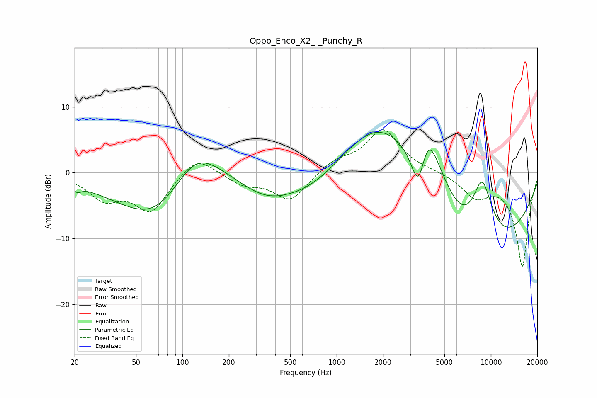

# Oppo_Enco_X2_-_Punchy_R
See [usage instructions](https://github.com/jaakkopasanen/AutoEq#usage) for more options and info.

### Parametric EQs
Apply preamp of -6.2 dB when using parametric equalizer.

|   # | Type    |   Fc (Hz) |    Q |   Gain (dB) |
|-----|---------|-----------|------|-------------|
|   1 | Peaking |        21 | 5.64 |        -0.9 |
|   2 | Peaking |        71 | 0.54 |        -9.4 |
|   3 | Peaking |       120 | 0.76 |         8.7 |
|   4 | Peaking |       345 | 0.81 |        -2.9 |
|   5 | Peaking |       704 | 0.59 |        -4.9 |
|   6 | Peaking |      1851 | 0.47 |        11.7 |
|   7 | Peaking |      3405 | 2.5  |       -10.4 |
|   8 | Peaking |      3840 | 1.37 |        14.1 |
|   9 | Peaking |      7838 | 0.36 |       -17.8 |
|  10 | Peaking |      8766 | 1.55 |        12.6 |

### Fixed Band EQs
When using fixed band (also called graphic) equalizer, apply preamp of **-6.6 dB** (if available) and set gains manually with these parameters.

|   # | Type    |   Fc (Hz) |    Q |   Gain (dB) |
|-----|---------|-----------|------|-------------|
|   1 | Peaking |        31 | 1.41 |        -3.6 |
|   2 | Peaking |        62 | 1.41 |        -5.7 |
|   3 | Peaking |       125 | 1.41 |         2.9 |
|   4 | Peaking |       250 | 1.41 |        -1.7 |
|   5 | Peaking |       500 | 1.41 |        -4.3 |
|   6 | Peaking |      1000 | 1.41 |         1.7 |
|   7 | Peaking |      2000 | 1.41 |         6.5 |
|   8 | Peaking |      4000 | 1.41 |         0.2 |
|   9 | Peaking |      8000 | 1.41 |        -3.3 |
|  10 | Peaking |     16000 | 1.41 |       -14.2 |

### Graphs

