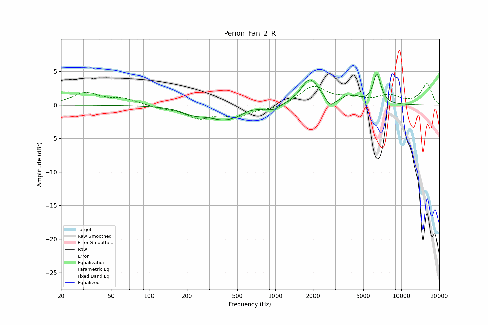

# Penon_Fan_2_R
See [usage instructions](https://github.com/jaakkopasanen/AutoEq#usage) for more options and info.

### Parametric EQs
Apply preamp of -4.6 dB when using parametric equalizer.

|   # | Type    |   Fc (Hz) |    Q |   Gain (dB) |
|-----|---------|-----------|------|-------------|
|   1 | Peaking |       221 | 1.76 |        -0.7 |
|   2 | Peaking |       411 | 0.89 |        -2.2 |
|   3 | Peaking |       628 | 2.05 |         0.4 |
|   4 | Peaking |       978 | 3.16 |        -0.6 |
|   5 | Peaking |      1889 | 2.02 |         3.9 |
|   6 | Peaking |      2735 | 4.41 |        -1.2 |
|   7 | Peaking |      4022 | 2.68 |         1.4 |
|   8 | Peaking |      4128 | 6    |        -1.4 |
|   9 | Peaking |      4145 | 4.9  |         1   |
|  10 | Peaking |      6421 | 4.43 |         4.3 |

### Fixed Band EQs
When using fixed band (also called graphic) equalizer, apply preamp of **-3.3 dB** (if available) and set gains manually with these parameters.

|   # | Type    |   Fc (Hz) |    Q |   Gain (dB) |
|-----|---------|-----------|------|-------------|
|   1 | Peaking |        31 | 1.41 |         1.7 |
|   2 | Peaking |        62 | 1.41 |         0.9 |
|   3 | Peaking |       125 | 1.41 |        -0.4 |
|   4 | Peaking |       250 | 1.41 |        -1.8 |
|   5 | Peaking |       500 | 1.41 |        -1.5 |
|   6 | Peaking |      1000 | 1.41 |        -0.5 |
|   7 | Peaking |      2000 | 1.41 |         2.7 |
|   8 | Peaking |      4000 | 1.41 |         0.8 |
|   9 | Peaking |      8000 | 1.41 |         1.2 |
|  10 | Peaking |     16000 | 1.41 |         3.1 |

### Graphs

