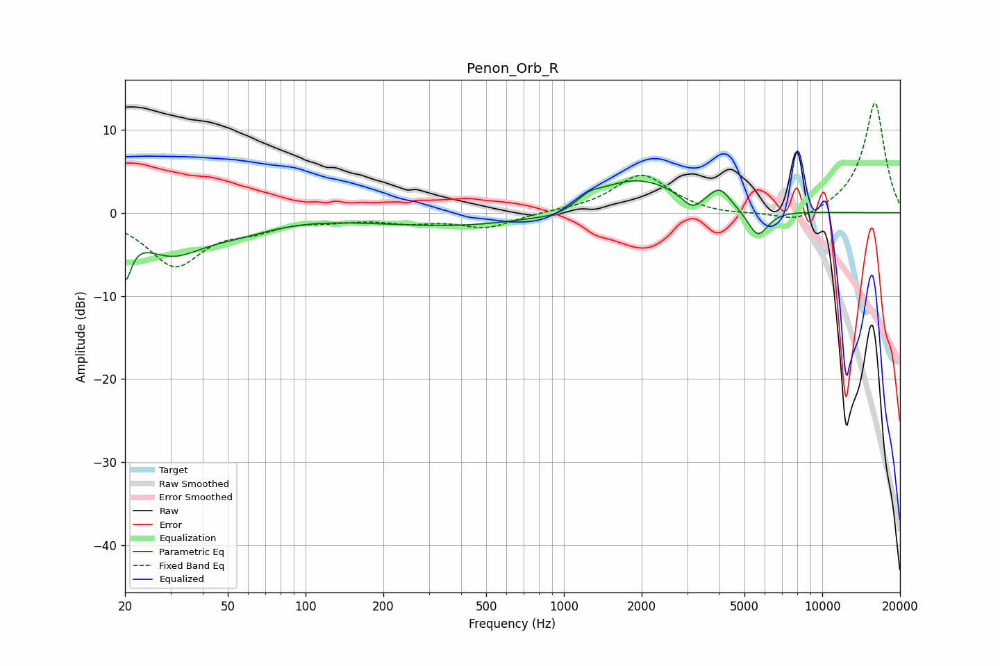

# Penon_Orb_R
See [usage instructions](https://github.com/jaakkopasanen/AutoEq#usage) for more options and info.

### Parametric EQs
Apply preamp of -3.9 dB when using parametric equalizer.

|   # | Type    |   Fc (Hz) |    Q |   Gain (dB) |
|-----|---------|-----------|------|-------------|
|   1 | Peaking |        20 | 5.88 |        -5.6 |
|   2 | Peaking |        30 | 1.12 |        -4.4 |
|   3 | Peaking |        55 | 0.99 |        -1.5 |
|   4 | Peaking |       413 | 0.4  |        -1.7 |
|   5 | Peaking |       961 | 1.69 |        -0.9 |
|   6 | Peaking |      1248 | 3.1  |         0.9 |
|   7 | Peaking |      1881 | 0.82 |         4.3 |
|   8 | Peaking |      3136 | 3.72 |        -1.7 |
|   9 | Peaking |      4011 | 3.5  |         2.1 |
|  10 | Peaking |      5631 | 3.41 |        -3.4 |

### Fixed Band EQs
When using fixed band (also called graphic) equalizer, apply preamp of **-13.3 dB** (if available) and set gains manually with these parameters.

|   # | Type    |   Fc (Hz) |    Q |   Gain (dB) |
|-----|---------|-----------|------|-------------|
|   1 | Peaking |        31 | 1.41 |        -6.2 |
|   2 | Peaking |        62 | 1.41 |        -1.5 |
|   3 | Peaking |       125 | 1.41 |        -0.6 |
|   4 | Peaking |       250 | 1.41 |        -0.9 |
|   5 | Peaking |       500 | 1.41 |        -1.7 |
|   6 | Peaking |      1000 | 1.41 |         0.1 |
|   7 | Peaking |      2000 | 1.41 |         4.6 |
|   8 | Peaking |      4000 | 1.41 |        -0.4 |
|   9 | Peaking |      8000 | 1.41 |        -1.5 |
|  10 | Peaking |     16000 | 1.41 |        13.4 |

### Graphs

