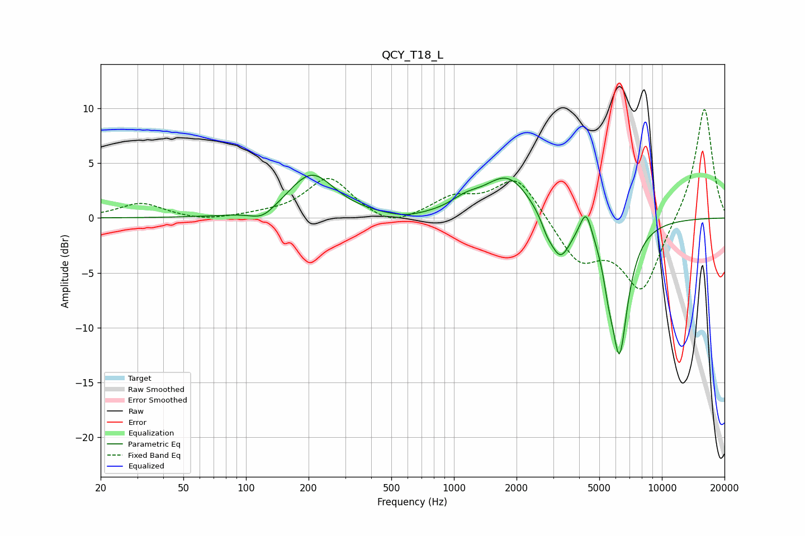

# QCY_T18_L
See [usage instructions](https://github.com/jaakkopasanen/AutoEq#usage) for more options and info.

### Parametric EQs
Apply preamp of -4.0 dB when using parametric equalizer.

|   # | Type    |   Fc (Hz) |    Q |   Gain (dB) |
|-----|---------|-----------|------|-------------|
|   1 | Peaking |       120 | 2.34 |        -1   |
|   2 | Peaking |       207 | 1.29 |         4   |
|   3 | Peaking |       574 | 1.57 |        -0.4 |
|   4 | Peaking |      1137 | 1.97 |         0.9 |
|   5 | Peaking |      1816 | 1.25 |         3.8 |
|   6 | Peaking |      2798 | 5.28 |        -0.8 |
|   7 | Peaking |      3237 | 2.72 |        -3.9 |
|   8 | Peaking |      4315 | 4.98 |         2.5 |
|   9 | Peaking |      5535 | 5.99 |        -1.9 |
|  10 | Peaking |      6250 | 3.27 |       -12   |

### Fixed Band EQs
When using fixed band (also called graphic) equalizer, apply preamp of **-10.0 dB** (if available) and set gains manually with these parameters.

|   # | Type    |   Fc (Hz) |    Q |   Gain (dB) |
|-----|---------|-----------|------|-------------|
|   1 | Peaking |        31 | 1.41 |         1.3 |
|   2 | Peaking |        62 | 1.41 |        -0.3 |
|   3 | Peaking |       125 | 1.41 |         0.2 |
|   4 | Peaking |       250 | 1.41 |         3.7 |
|   5 | Peaking |       500 | 1.41 |        -1.1 |
|   6 | Peaking |      1000 | 1.41 |         1.7 |
|   7 | Peaking |      2000 | 1.41 |         3.9 |
|   8 | Peaking |      4000 | 1.41 |        -3.8 |
|   9 | Peaking |      8000 | 1.41 |        -6.6 |
|  10 | Peaking |     16000 | 1.41 |        10.3 |

### Graphs

